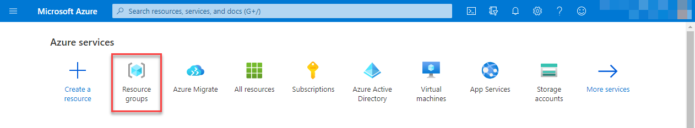
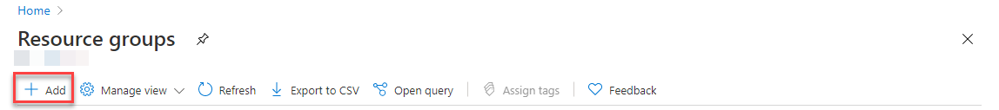
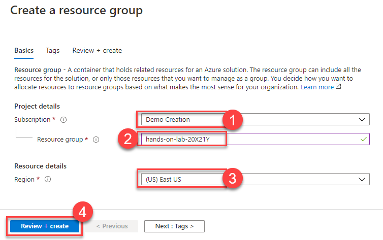
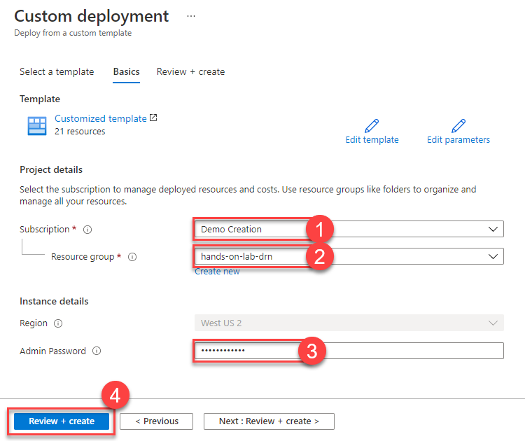
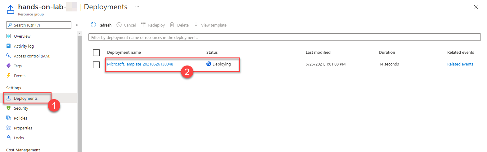

<div class="MCWHeader1">
[Insert workshop name here]
</div>

<div class="MCWHeader2">
Before the hands-on lab setup guide
</div>

<div class="MCWHeader3">
[Insert date here Month Year]
</div>

Information in this document, including URL and other Internet Web site references, is subject to change without notice. Unless otherwise noted, the example companies, organizations, products, domain names, e-mail addresses, logos, people, places, and events depicted herein are fictitious, and no association with any real company, organization, product, domain name, e-mail address, logo, person, place or event is intended or should be inferred. Complying with all applicable copyright laws is the responsibility of the user. Without limiting the rights under copyright, no part of this document may be reproduced, stored in or introduced into a retrieval system, or transmitted in any form or by any means (electronic, mechanical, photocopying, recording, or otherwise), or for any purpose, without the express written permission of Microsoft Corporation.

Microsoft may have patents, patent applications, trademarks, copyrights, or other intellectual property rights covering subject matter in this document. Except as expressly provided in any written license agreement from Microsoft, the furnishing of this document does not give you any license to these patents, trademarks, copyrights, or other intellectual property.

The names of manufacturers, products, or URLs are provided for informational purposes only and Microsoft makes no representations and warranties, either expressed, implied, or statutory, regarding these manufacturers or the use of the products with any Microsoft technologies. The inclusion of a manufacturer or product does not imply endorsement of Microsoft of the manufacturer or product. Links may be provided to third party sites. Such sites are not under the control of Microsoft and Microsoft is not responsible for the contents of any linked site or any link contained in a linked site, or any changes or updates to such sites. Microsoft is not responsible for webcasting or any other form of transmission received from any linked site. Microsoft is providing these links to you only as a convenience, and the inclusion of any link does not imply endorsement of Microsoft of the site or the products contained therein.

© 2021 Microsoft Corporation. All rights reserved.

Microsoft and the trademarks listed at <https://www.microsoft.com/en-us/legal/intellectualproperty/Trademarks/Usage/General.aspx> are trademarks of the Microsoft group of companies. All other trademarks are property of their respective owners.

**Contents**

<!-- TOC -->

- [\[insert workshop name here\] before the hands-on lab setup guide](#\insert-workshop-name-here\-before-the-hands-on-lab-setup-guide)
  - [Requirements](#requirements)
  - [Before the hands-on lab](#before-the-hands-on-lab)
    - [Task 1: Provision a resource group](#task-1-provision-a-resource-group)
    - [Task 2: Run ARM template to provision lab resources](#task-3-run-arm-template-to-provision-lab-resources)
    - [Task 3: Download lab artifacts](#task-3-download-lab-artifacts)
    - [Task 4: Establish a user context](#task-4-establish-a-user-context)
    - [Task 5: Run environment setup PowerShell script](#task-5-run-environment-setup-powershell-script)

<!-- /TOC -->

# \[insert workshop name here\] before the hands-on lab setup guide

## Requirements

- Microsoft Azure subscription must be pay-as-you-go or MSDN.
  - Trial subscriptions will _not_ work.

## Before the hands-on lab

Duration: 20 minutes

In this exercise, you set up an environment for use in the rest of the hands-on lab. You should follow all steps provided _before_ attending the Hands-on lab.

> **IMPORTANT**: Many Azure resources require globally unique names. Throughout these steps, the word "SUFFIX" appears as part of resource names. You should replace this with your Microsoft alias, initials, or another value to ensure resources are uniquely named.

### Task 1: Provision a resource group

In this task, you create an Azure resource group to serve as a container for the resources used throughout this lab.

1. In the [Azure portal](https://portal.azure.com), select **Resource groups** from the Azure services list.

   

2. On the Resource groups blade, select **+Add**.

   

3. On the Create a resource group **Basics** tab, enter the following:

   - **Subscription (1)**: Select the subscription you are using for this hands-on lab.
   - **Resource group (2)**: Enter **hands-on-lab-SUFFIX** as the name of the new resource group.
   - **Region (3)**: Select the region you are using for this hands-on lab.

   

4. Select **Review + Create (4)**.

5. On the **Review + create** tab, ensure the Validation passed message is displayed and then select **Create**.

### Task 2: Run ARM template to provision lab resources

1. To run the ARM template deployment, select the **Deploy to Azure** button below, which opens a custom deployment screen in the Azure portal.

   <a href ="https://portal.azure.com/#create/Microsoft.Template/uri/https%3A%2F%2Fraw.githubusercontent.com%2Fsolliancenet%2FSolliance_AI_Led_business_process_automation%2Fmain%2FHands-on%2520lab%2Flab-files%2FARM-template%2Fazure-deploy.json" target="_blank" title="Deploy to Azure">
      
   </a>

2. On the custom deployment screen in the Azure portal, enter the following:

   - **Subscription (1)**: Select the subscription you are using for this hands-on lab.
   - **Resource group (2)**: Select the hands-on-lab-SUFFIX resource group from the dropdown list.
   - **Admin Password (3)**: Type in your custom password you will be using for the rest of the lab. The default password is `Password.1!!`

    

3. Select **Review + create** and select **Create** on the next step to start provisioning the lab resources.

   > **Note**: The deployment of the custom ARM template takes about 10 minutes to complete. If the error indicates an issue with quotas in the region you selected for the resource group, you can delete the resource group, create a new resource group in a different region, and re-run the ARM template, or you can request a quota increase and then manually provision the missing resources.

4. You can monitor the progress of the deployment by navigating to the hands-on-lab-SUFFIX resource group in the Azure portal and then selecting **Deployments (1)** from the left-hand menu. The deployment should be named **Microsoft.Template (2)**. Select the deployment item to view the progress of each individual component in the template.

   

### Task 3: Download lab artifacts

1. In the Azure Portal, open the Azure Cloud Shell by selecting its icon from the right side of the top toolbar. Be sure to select **Powershell** as the shell type.

    

    > **Note**: If you are prompted to create a storage account for the Cloud Shell, agree to have it created.

2. In the Cloud Shell window, enter the following command to clone the repository files.

    ```PowerShell
    git clone https://github.com/solliancenet/Solliance_AI_Led_business_process_automation.git MCW
    ```

3. Keep the Cloud Shell open.

### Task 4: Establish a user context

1. In the Cloud Shell, execute the following command:

    ```cli
    az login
    ```

2. A message will be displayed asking you to open a new tab in your web browser, navigate to [https://microsoft.com/devicelogin](https://microsoft.com/devicelogin) and to enter a code for authentication.

   

   

3. Once complete, you may close the tab from the previous step and return to the Cloud Shell.

### Task 5: Run environment setup PowerShell script

When executing the script below, it is important to let the scripts run to completion. Some tasks may take longer than others to run. When a script completes execution, you will be returned to a command prompt.

1. In the Cloud Shell, change the current directory to the **automation** folder of the cloned repository by executing the following:

    ```PowerShell
    cd "./MCW/Hands-on lab/lab-files/ARM-template"
    ```

2. Execute the **post-provisioning.ps1** script by executing the following command:

    ```PowerShell
    ./post-provisioning.ps1
    ```

    You will be prompted to enter the name of your desired Azure Subscription. You can copy and paste the value from the list to select one. You will also be prompted for the following information for this script:

    | Prompt |
    |--------|
    | Enter the desired Azure Subscription for this lab (you will be able to copy and paste from a listing) |
    | Enter the name of your resource group. |

3. At the end of the script, you should see a message indicating **Environment setup complete**.
