

AI Led Business Process Automation

Hands-on lab step-by-step

June 2021

Information in this document, including URL and other Internet Web site references, is subject to change without notice. Unless otherwise noted, the example companies, organizations, products, domain names, e-mail addresses, logos, people, places, and events depicted herein are fictitious, and no association with any real company, organization, product, domain name, e-mail address, logo, person, place or event is intended or should be inferred. Complying with all applicable copyright laws is the responsibility of the user. Without limiting the rights under copyright, no part of this document may be reproduced, stored in or introduced into a retrieval system, or transmitted in any form or by any means (electronic, mechanical, photocopying, recording, or otherwise), or for any purpose, without the express written permission of Microsoft Corporation.

Microsoft may have patents, patent applications, trademarks, copyrights, or other intellectual property rights covering subject matter in this document. Except as expressly provided in any written license agreement from Microsoft, the furnishing of this document does not give you any license to these patents, trademarks, copyrights, or other intellectual property.

The names of manufacturers, products, or URLs are provided for informational purposes only and Microsoft makes no representations and warranties, either expressed, implied, or statutory, regarding these manufacturers or the use of the products with any Microsoft technologies. The inclusion of a manufacturer or product does not imply endorsement of Microsoft of the manufacturer or product. Links may be provided to third party sites. Such sites are not under the control of Microsoft and Microsoft is not responsible for the contents of any linked site or any link contained in a linked site, or any changes or updates to such sites. Microsoft is not responsible for webcasting or any other form of transmission received from any linked site. Microsoft is providing these links to you only as a convenience, and the inclusion of any link does not imply endorsement of Microsoft of the site or the products contained therein.

© 2021 Microsoft Corporation. All rights reserved.

Microsoft and the trademarks listed at <https://www.microsoft.com/en-us/legal/intellectualproperty/Trademarks/Usage/General.aspx> are trademarks of the Microsoft group of companies. All other trademarks are property of their respective owners.

**Contents**

<!-- TOC -->

- [AI Led Business Process Automation hands-on lab step-by-step](#ai-led-business-process-automation-hands-on-lab-step-by-step)
  - [Abstract and learning objectives](#abstract-and-learning-objectives)
  - [Overview](#overview)
  - [Solution architecture](#solution-architecture)
  - [Requirements](#requirements)
  - [Before the hands-on lab](#before-the-hands-on-lab)
  - [Exercise 1: Extract text and structure from documents with Forms Recognizer](#exercise-1-extract-text-and-structure-from-documents-with-forms-recognizer)
    - [Task 1: Prepare custom model to process documents](#task-1-prepare-custom-model-to-process-documents)
    - [Task 2: Configuring Azure Functions and Event Grid for document uploads](#task-2-configuring-azure-functions-and-event-grid-for-document-uploads)
    - [Task 3: Connecting CosmosDB and Forms Recognizer to Azure Functions](#task-3-connecting-cosmosdb-and-forms-recognizer-to-azure-functions)
    - [Task 4: Running document processing automation](#task-4-running-document-processing-automation)
  - [Exercise 2: Extract Health Analytics from visit audio records](#exercise-2-extract-health-analytics-from-visit-audio-records)
    - [Task 1: Configuring Azure Functions and Event Grid for audio uploads](#task-1-configuring-azure-functions-and-event-grid-for-audio-uploads)
    - [Task 2: Connecting Cognitive Services to Azure Functions](#task-2-connecting-cognitive-services-to-azure-functions)
    - [Task 3: Running audio record processing automation](#task-3-running-audio-record-processing-automation)
  - [Exercise 3: Using Azure Cognitive Search to index and serve data](#exercise-3-using-azure-cognitive-search-to-index-and-serve-data)
    - [Task 1: Setting up indexer for forms documents](#task-1-setting-up-indexer-for-forms-documents)
    - [Task 2: Setting up indexer for audio transcriptions and health analytics](#task-2-setting-up-indexer-for-audio-transcriptions-and-health-analytics)
    - [Task 3: Connecting Azure Cognitive Search to hospital portal](#task-3-connecting-azure-cognitive-search-to-hospital-portal)
  - [Exercise 4: Building custom PowerBI reports on healthcare data](#exercise-4-building-custom-powerbi-reports-on-healthcare-data)
    - [Task 1: Connecting PowerBI to CosmosDB](#task-1-connecting-powerbi-to-cosmosdb)
    - [Task 2: Creating PowerBI report unifying structured and unstructured data](#task-2-creating-powerbi-report-unifying-structured-and-unstructured-data)
  - [After the hands-on lab](#after-the-hands-on-lab)
    - [Task 1: Task name](#task-1-task-name)
    - [Task 2: Task name](#task-2-task-name)

<!-- /TOC -->

# AI Led Business Process Automation hands-on lab step-by-step

## Abstract and learning objectives

\[Insert what is trying to be solved for by using this workshop. . . \]

## Overview

\[insert your custom workshop content here . . . \]

## Solution architecture

Below is a high-level architecture diagram of the solution you implement in this hands-on lab. Please review this carefully to understand the whole of the solution as you are working on the various components.

> **Note:** The solution provided is only one of many possible, viable approaches.

Hospitals in the Contoso Healthcare network provide PDF files of claim forms and WAV files of visit audio recordings via blobs in an Azure Storage account. Two event grid subscriptions propagate the blob creation events that trigger two separate functions in a [Function App](https://docs.microsoft.com/en-us/azure/azure-functions/functions-create-function-app-portal).

One of the functions handles PDF processing. The function uses an [Azure Forms Recognizer](https://azure.microsoft.com/en-us/services/form-recognizer/) that has a custom trainer model to extract the required information from forms. Once the metadata is extracted, the function saves the result in [Azure CosmosDB](https://azure.microsoft.com/en-us/services/cosmos-db/), allowing Contoso to build custom PowerBI reports with a direct query connection. Additionally, the data is indexed in an [Azure Cognitive Search](https://azure.microsoft.com/en-us/services/search/) to be served in a unified search experience on the internal hospital portal.

A second function in the Function App processes audio recordings. Contoso uses [Azure Cognitive Speech Audio Language Identification](https://docs.microsoft.com/en-us/azure/cognitive-services/speech-service/how-to-automatic-language-detection?pivots=programming-language-csharp) to detect the language of the audio file and transcribe it to text. Once the text transcriptions are ready, Spanish transcriptions are translated to English using [Azure Cognitive Services Text Translator](https://azure.microsoft.com/en-us/services/cognitive-services/translator/). Finally, [Azure Cognitive Services Text Analytics for Health](https://docs.microsoft.com/en-us/azure/cognitive-services/text-analytics/how-tos/text-analytics-for-health?tabs=ner) is used to extract and label relevant medical information to provide a richer search experience in the internal hospital portal. Once the results are ready, the function saves the data in an Azure CosmosDB collection to be indexed by Azure Cognitive Search.

Finally, the internal hospital portal queries the indexes created in Azure Cognitive Search, offering a unified search experience for both structured and unstructured data sets.

## Requirements

- Microsoft Azure subscription must be pay-as-you-go or MSDN.
  - Trial subscriptions will _not_ work.

## Before the hands-on lab

Refer to the Before the hands-on lab setup guide manual before continuing to the lab exercises.

## Exercise 1: Extract text and structure from documents with Forms Recognizer

Duration: 45 minutes

Azure Form Recognizer is a part of [Azure Applied AI Services](https://docs.microsoft.com/en-us/azure/applied-ai-services/) that lets you build automated data processing software using machine learning technology. You can identify and extract text, key/value pairs, selection marks, tables, and structure from your documents. The service outputs structured data that includes the relationships in the original file, bounding boxes, confidence, and more. You can quickly get accurate results tailored to your specific content without heavy manual intervention or extensive data science expertise. Form Recognizer comprises custom document processing models, prebuilt models for invoices, receipts, IDs and business cards, and the layout model.

Contoso has its own document template for claims processing. In this exercise, you will be using a set of documents to train a custom model with labels. When you train with labeled data, the model uses supervised learning to extract values of interest, using the labeled forms you provide. In this case, Form Recognizer uses the [Layout API](https://docs.microsoft.com/en-us/azure/cognitive-services/form-recognizer/concept-layout) to learn the expected sizes and positions of printed and handwritten text elements and extract values.

### Task 1: Prepare custom model to process documents

1. To access the training data in Azure Storage, we need a [SAS](https://docs.microsoft.com/en-us/rest/api/storageservices/delegate-access-with-shared-access-signature) access link. In the [Azure portal](https://portal.azure.com), navigate to your **contosoSUFFIX** Storage Account Overview page by selecting **Resource groups** from Azure services list, selecting the **hands-on-lab-SUFFIX** resource group, and selecting the **contosoSUFFIX** Storage Account from the list of resources.

   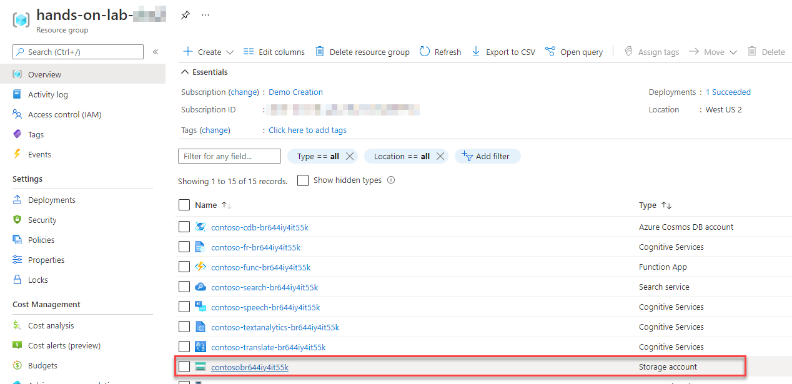

2. Once you are on the Storage Account Overview page, switch to the **Containers (1)** panel.  Select **claimstraining (2)** container and open the context menu with the three dots **(3)** at the end of the row. Select **Generate SAS (4)**.

   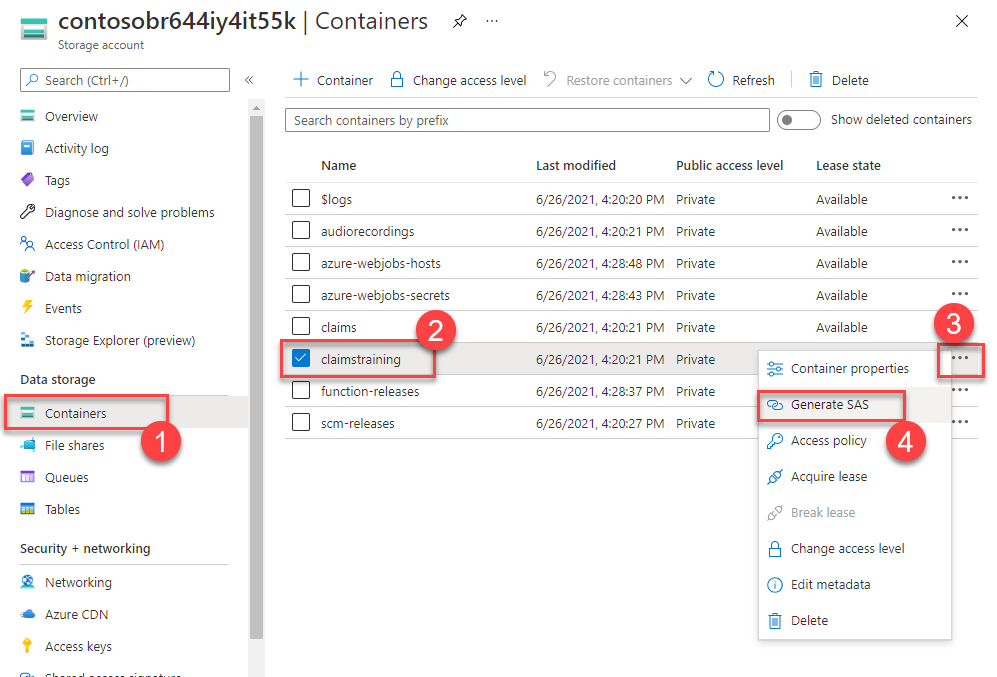

3. On the Generate SAS panel, select all **Permissions (1)**. Set the **Expiry (2)** date to a future date so that the link does not expire while you work on your lab. Select **Generate SAS token and URL (3)** and copy the **Blob SAS URL (4)** in a text editor of your choice to be used in upcoming steps during the lab.

   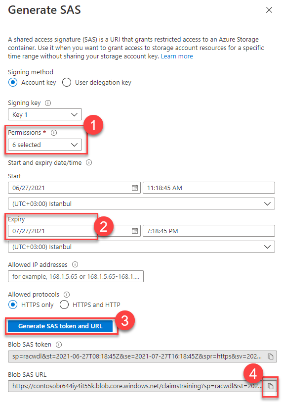

4. Go back to your resource group and select **contoso-fr-SUFFIX (1)** Azure Forms Recognizer service where SUFFIX represents a unique string specific to your resource group.

   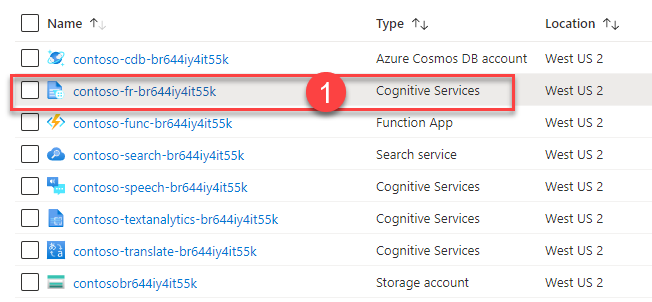

5. Switch to the **Keys and Endpoint (1)** panel. Copy **Key 1 (2)** and **Endpoint (3)** to a text editor of your choice to be used in upcoming steps during the lab.

   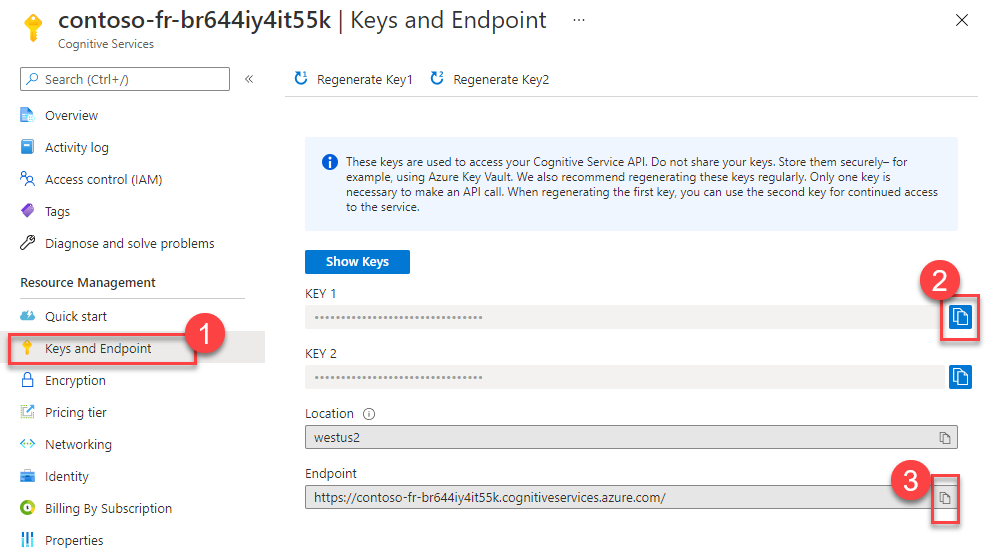

6. Navigate to <https://fott-2-1.azurewebsites.net/> in a browser window.

7. Select **Use Custom to train a model with labels and get key value pairs**.

   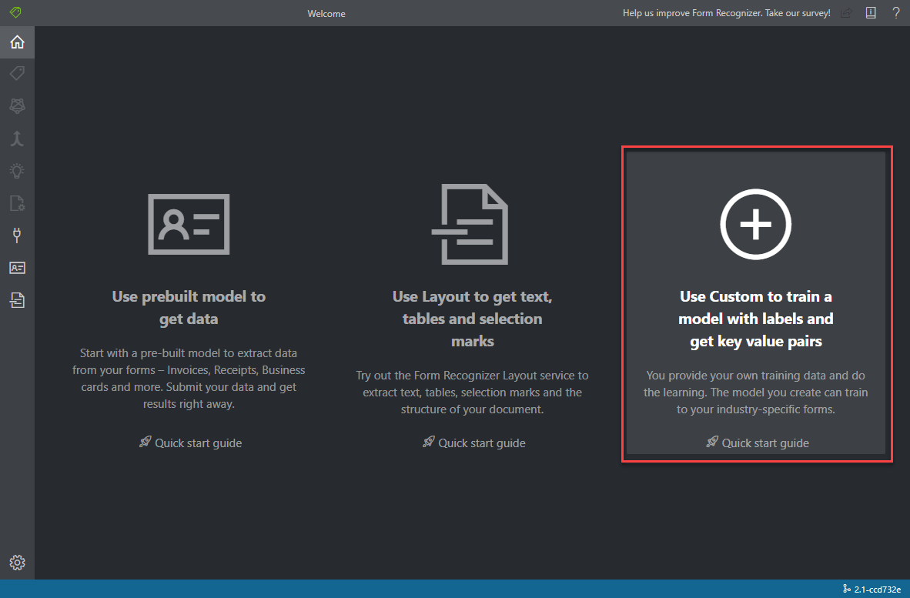

8. Select **New Project**.

   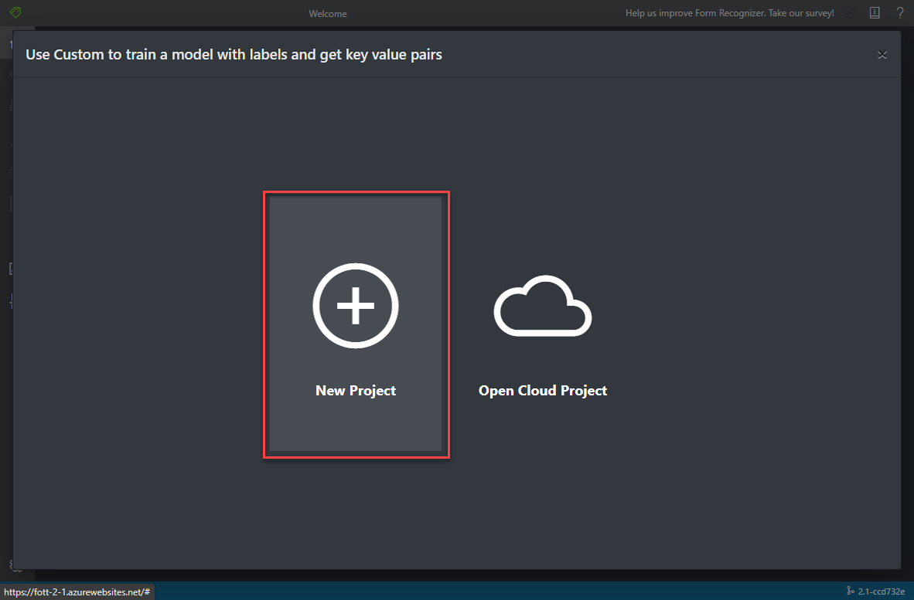

9. Set **Display Name (1)** to **ContosoDocuments** and select **Add Connection (2)**.

   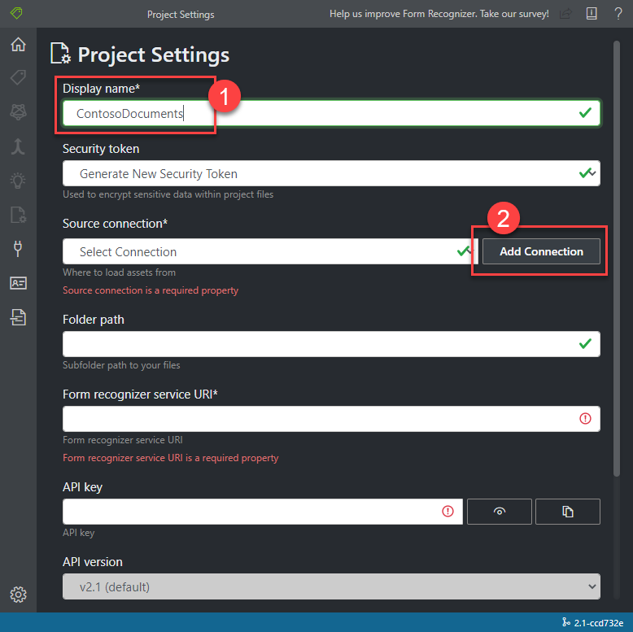

10. Set **Display name (1)** to **DocumentSource** and past the previously copies SAS URL into the **SAS URI (2)** box. Select **Save Connection (3)** to continue.

    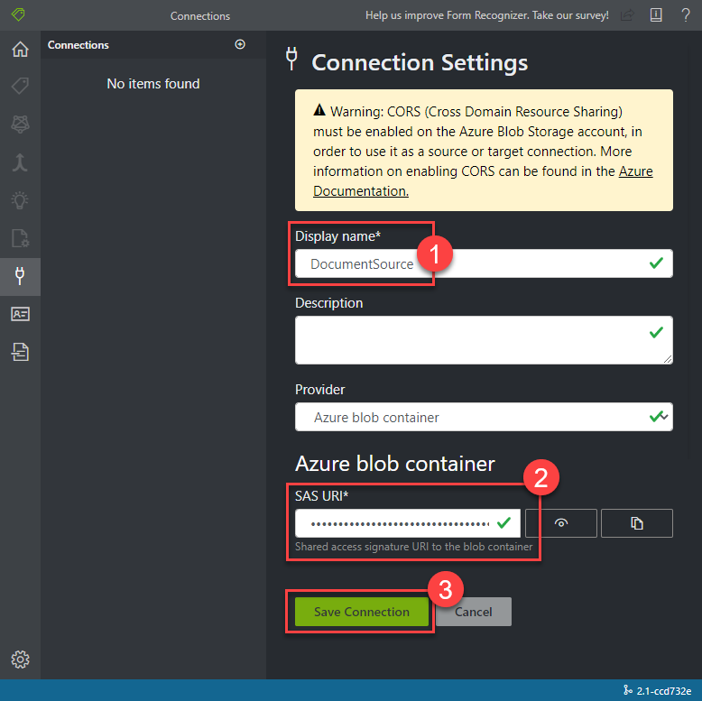

11. Select **Go Back (1)** from your browser twice to go back to the **Project Settings** page.

12. Set the values listed below.

    - **Source Connection (2):** **DocumentSource**
    - **Form recognizer service URI (3):** Previously copied **Endpoint** value from Forms Recognizer.
    - **API key (4):** Previously copied **Key 1** value from Forms Recognizer.

    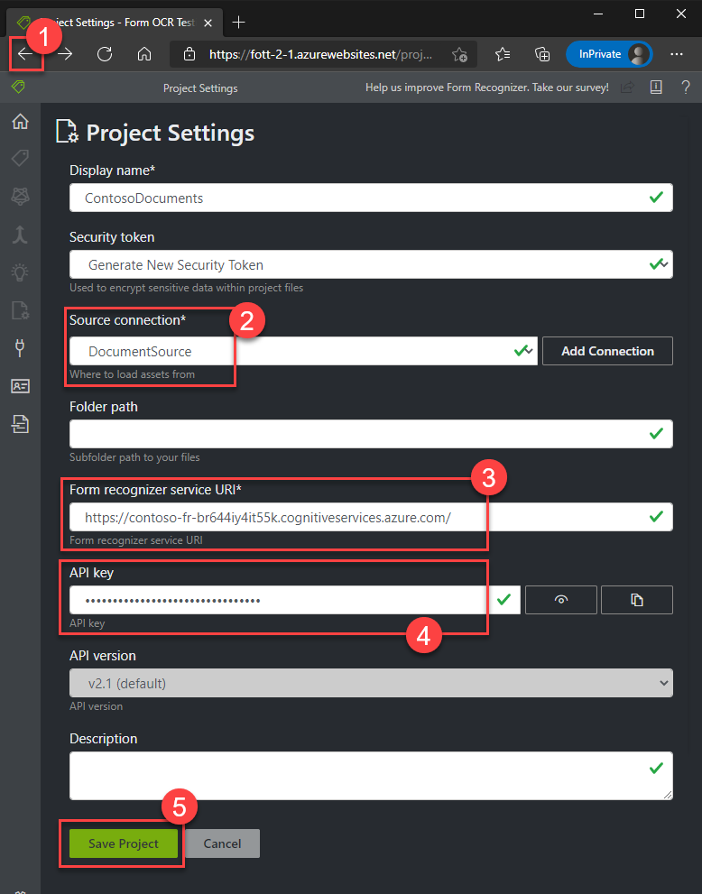

    Select **Save Project (5)** to continue.

13. The documents you will use for training can be seen in the **documents panel (1)**. Observe the **tags (2)** assigned for various fields in the documents and how values are extracted with the Layout API.

    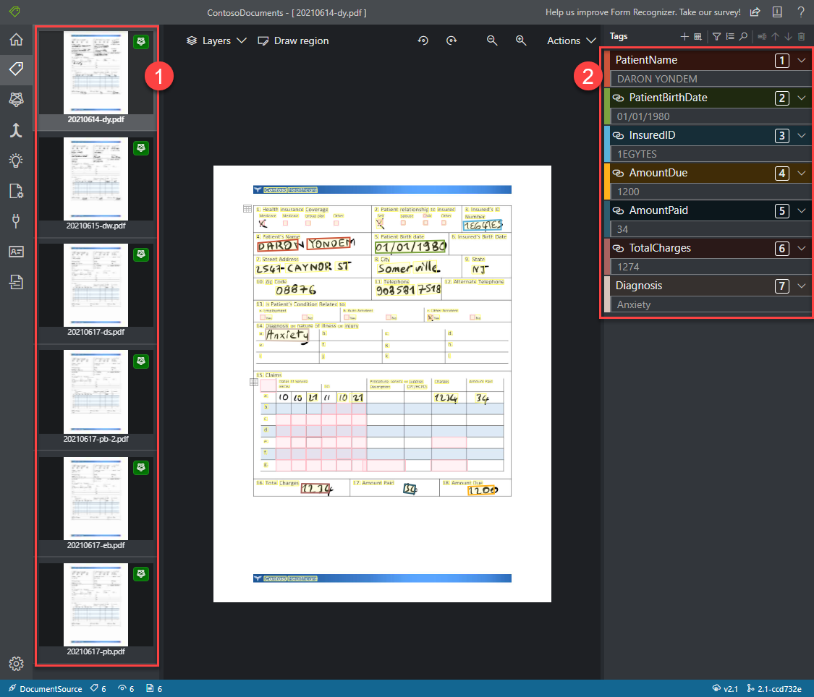

14. Switch to the **Train (1)** page. Set **Model name (2)** to **ContosoModel** and select **Train (3)** to start the model training.

    

15. Your trained model is ready. Observe the estimated accuracy for each tag/label **(1)** and average accuracy **(2)** for the model.  

    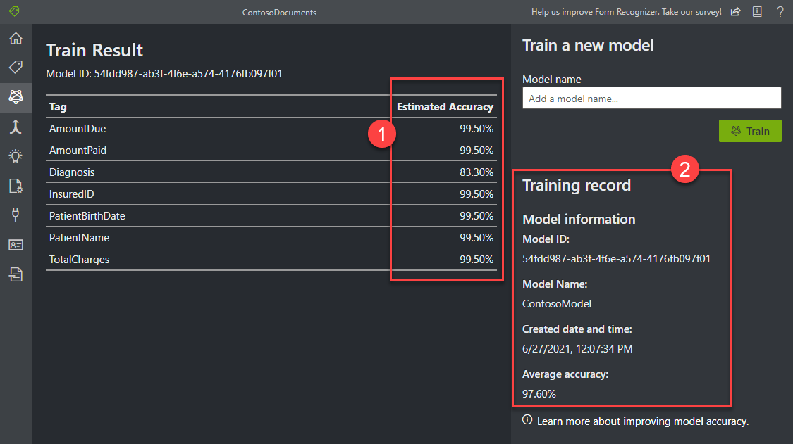

### Task 2: Configuring Azure Functions and Event Grid for document uploads

As part of its automation process, Contoso will upload claims documents in the form of PDF files to an Azure Storage account as blobs. An Azure Function App has to detect new files and process them with the trained Forms Recognizer Model. [Event Grid](https://docs.microsoft.com/en-us/azure/event-grid/overview) is the perfect candidate to build applications with event-based architectures thanks to its built-in support for events coming from Azure services, like storage blobs and resource groups. For the Functions App to detect new blobs, you will be using an Azure Event Grid subscription and defining an event handler for the matching Azure Function.

1. In the [Azure portal](https://portal.azure.com), navigate to your **contosoSUFFIX** Storage Account Overview page by selecting **Resource groups** from Azure services list selecting the **hands-on-lab-SUFFIX** resource group, and selecting the **contosoSUFFIX** Storage Account from the list of resources.

   

2. Switch to the **Events (1)** panel. Make sure you are on the **Get Started (2)** page. Select **Azure Function (3)** as the event destination type. Select **Create (4)** to continue.

   

3. From the list of function apps, select the arrow **(1)** for the function app named **contoso-func-SUFFIX** to get a list of functions available. From the list, select the **ClaimsProcessing** function.

   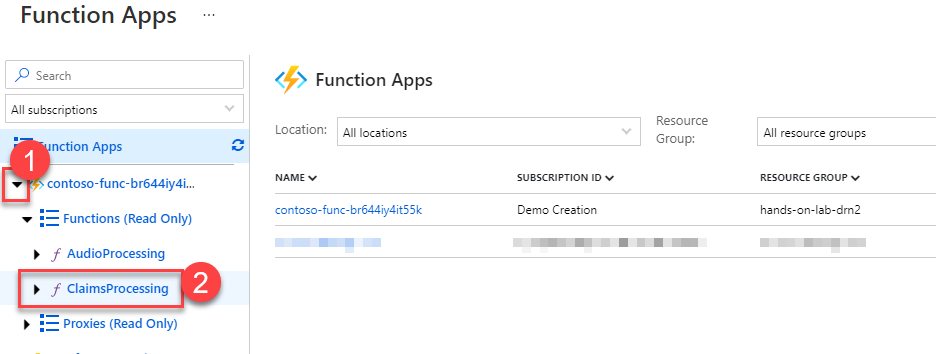

4. Select **Add Event Grid Subscription (1)**.

   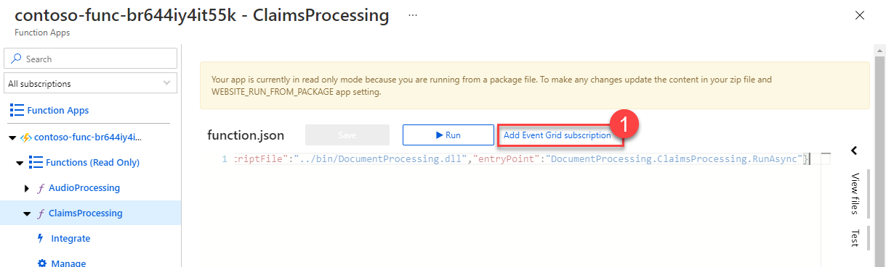

5. Set the values listed below.

    - **Name (1):** **DocumentEvents**
    - **Topic Type (2):** Storage account.
    - **Source Resource (3):** Contoso storage account.
    - **System Topic Name (4):** **DocumentEvent**
    - **Filter to Event Types (5):** Blob Created

   

    Select **Create (6)** to continue.

### Task 3: Connecting CosmosDB and Forms Recognizer to Azure Functions

For the document processing automation, our Azure Function must read the documents from Azure Storage, connect to Azure Forms Recognizer and use the trained model, and finally connect to CosmosDB to save the final results. In this task, we will connect all the required services to the ClaimsProcessing function.

1. In the [Azure portal](https://portal.azure.com), navigate to your **contosoSUFFIX** Storage Account Overview page by selecting **Resource groups** from Azure services list selecting the **hands-on-lab-SUFFIX** resource group, and selecting the **contosoSUFFIX** Storage Account from the list of resources.

   

2. Switch to the **Access keys (1)** panel. Select **Show keys (2)** to reveal the keys. Select the copy button **(3)** for the first connection string and paste it to a text editor of your choice to be used in the following steps.

   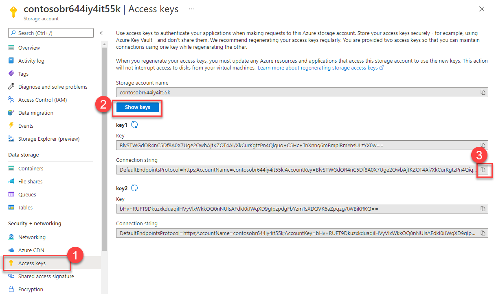

3. Go back to your resource group and find your Cosmos DB account in your lab resource group. Select it to navigate to its Overview page.

   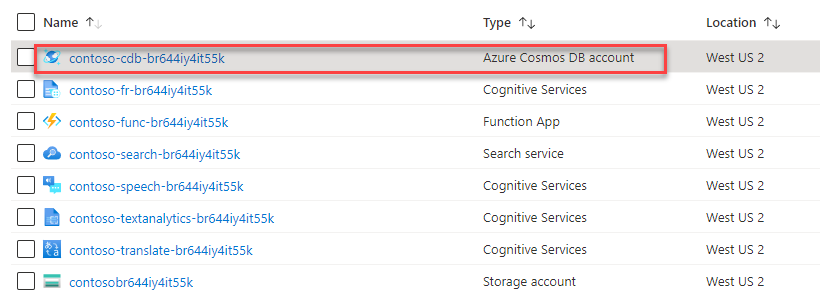

4. Switch to the **Keys (1)** panel. Copy the values for **URI (2)** and **PRIMARY KEY (3)** to a text editor of your choice to be used in the following steps.

   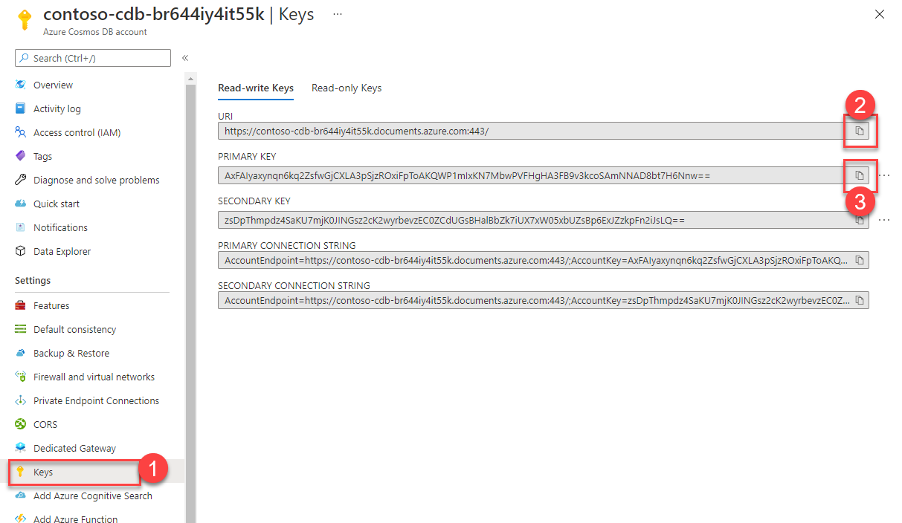

5. Go back to your resource group and find your Function App named **contoso-func-SUFFIX** in your lab resource group. Select it to navigate to its Overview page.

   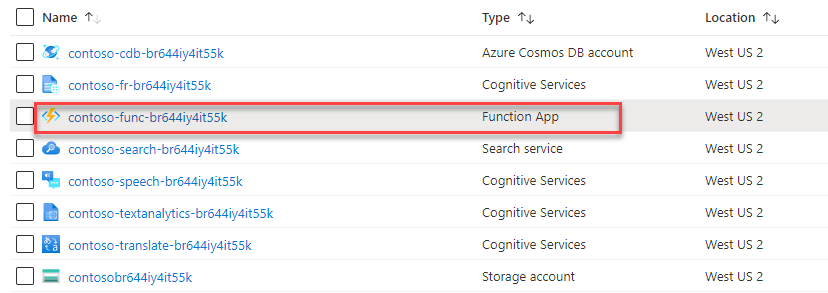

6. Switch to the **Configuration (1)** panel. Select **New application setting (2)**.

   

7. Set **Name (1)** to **ContosoStorageConnectionString** and **Value (2)** to the previously copied Contoso storage account connection string. Select **OK (3)** to save.

   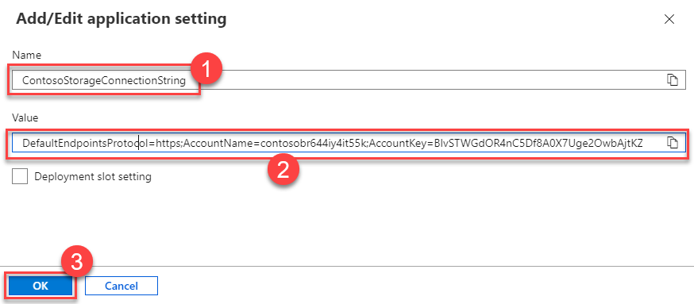

8. Repeat the same steps to add the **Application Settings** listed below.

   | Name                    | Value                                               |
   |-------------------------|-----------------------------------------------------|
   | FormsRecognizerEndpoint | Previously copied **Endpoint** for Forms Recognizer |
   | FormsRecognizerKey      | Previously copied **Key 1** for Forms Recognizer    |
   | CosmosDBEndpointUrl     | Previously copied **URI** for Cosmos DB             |
   | CosmosDBPrimaryKey      | Previously copied **Primary Key** for Cosmos DB     |

9. Once all settings **(1)** are set, select **Save (2)**.

   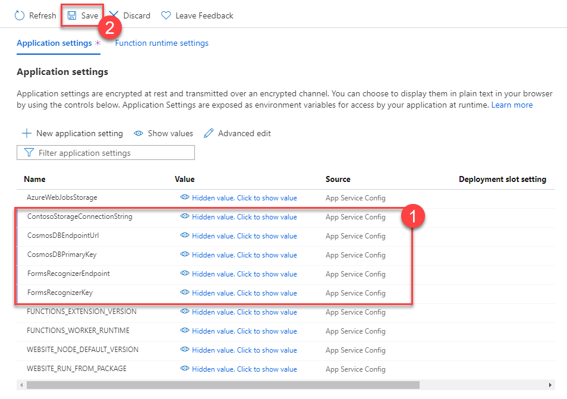

### Task 4: Running document processing automation

Now that all implementations are completed, we can upload a new document to the storage and see the entire process extracting values from claims submissions.

1. In the [Azure portal](https://portal.azure.com), navigate to your **LabVM** Virtual Machine by selecting **Resource groups** from Azure services list, selecting the **hands-on-lab-SUFFIX** resource group, and selecting the **WabVM** Virtual Machine from the list of resources.

    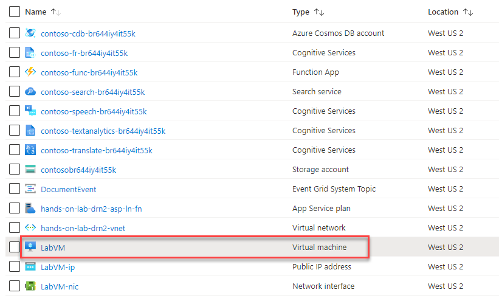

2. On the LabVM Virtual Machine's **Overview** blade, select **Connect (1)** and **RDP (2)** on the top menu.

   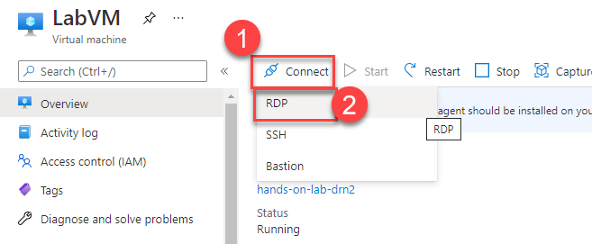

3. Select **Download RDP File** on the next page, and open the downloaded file.

    > **Note**: The first time you connect to the LabVM Virtual Machine, you will see a blue pop-up terminal dialog taking you through a couple of software installs. Don't be alarmed, and wait until the installs are complete.

    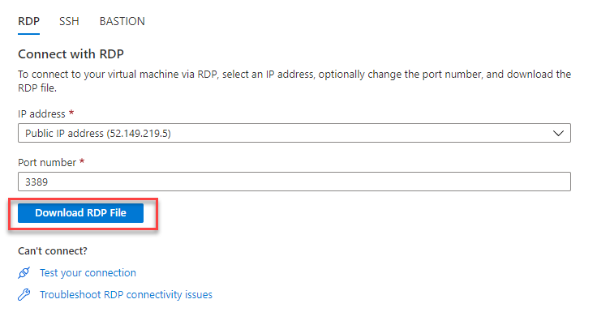

4. Select **Connect** on the Remote Desktop Connection dialog.

    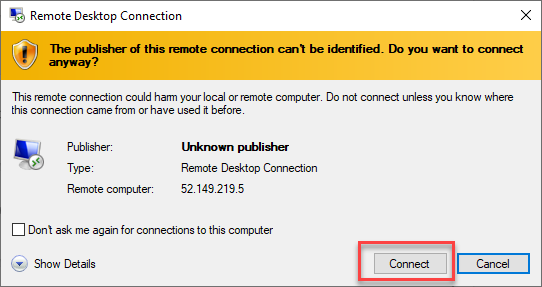

5. Enter the following credentials with your password when prompted, and then select **OK**:

   - **Username**: demo
   - **Password**: {YOUR-ADMIN-PASSWORD}
  
    > **Note**: default password is `Password.1!!`

    

6. Select **Yes** to connect if prompted that the remote computer's identity cannot be verified.

    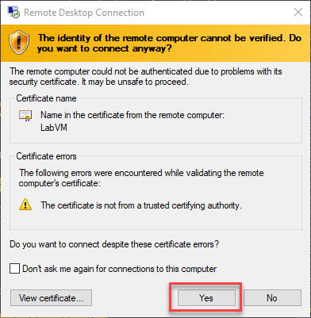

7. Once logged into the LabVM VM, a script will execute to install the various items needed for the remaining lab steps.

8. Once the script completes, open **Edge** and navigate to the [Azure portal](https://portal.azure.com). Enter your credentials to access your subscriptions. Navigate to **contosoSUFFIX** storage account by selecting **Resource groups** from Azure services list, selecting the **hands-on-lab-SUFFIX** resource group, and selecting the **contosoSUFFIX** Storage Account from the list of resources.

    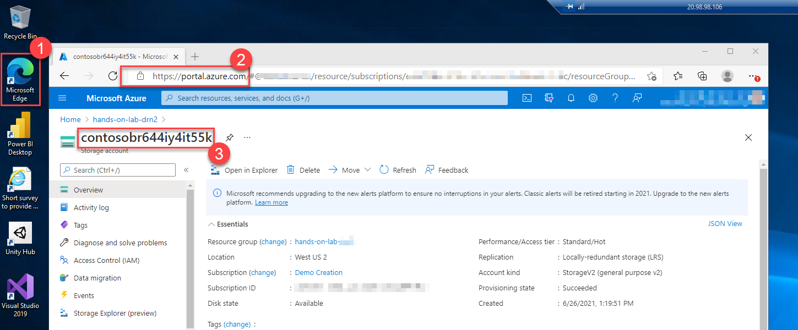

9. Switch to the **Containers (1)** panel. Select the **claims (2)** container.

   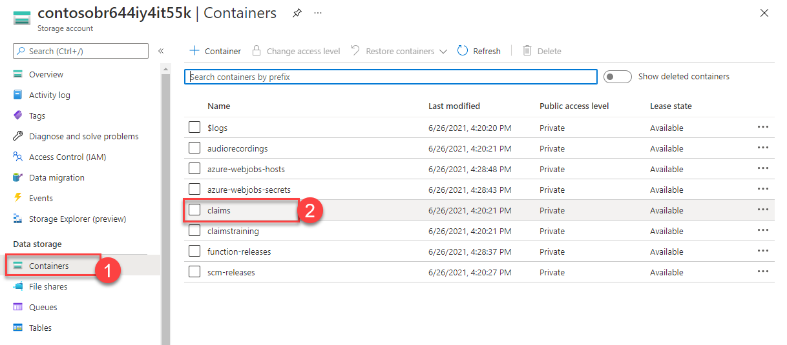

10. Select **Upload (1)** and **Browse (2)**. Navigate to `C:\MCW\MCW-main\Hands-on lab\lab-files\claims-forms` **(3)**. Pick **20210621-test-form (4)** and select **Open (5)**. This PDF file is brand new in the eyes of our trained model and not used during model training.

    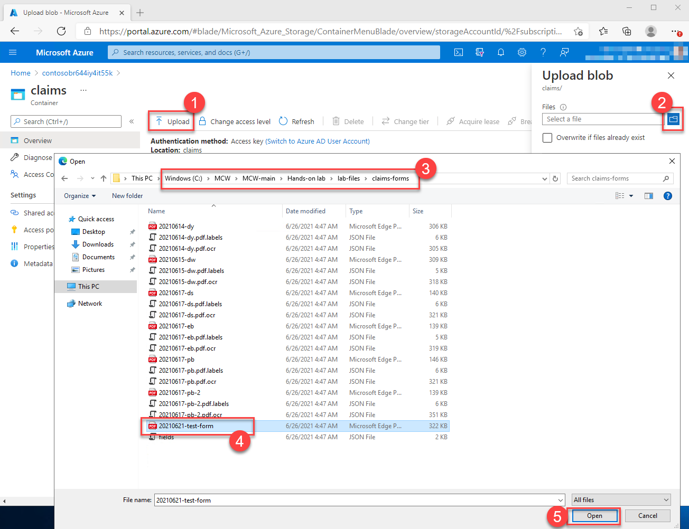

11. Select **Upload** to start the upload process.

    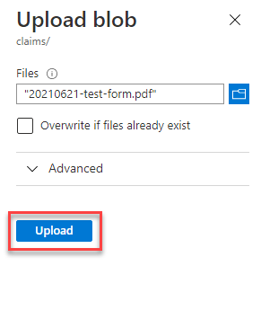

12. Now, if everything went smoothly, we should see the result in the Cosmos DB service. Go back to your resource group and find your Cosmos DB Account named `contoso-cdb-SUFFIX` in your lab resource group. Select it to navigate to its Overview page.

    

13. Select **Data Explorer**.

    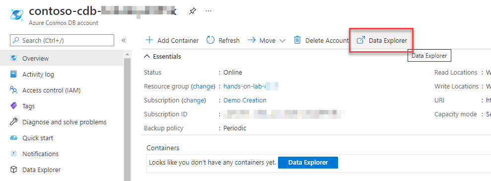

14. Select the **Items (1)** list under the **Contoso** database's **Claims** collection. Select the first document **(2)** to see its content. Take a look at the values extracted by Forms Recognizer, such as **PatientName** and **Diagnosis (3)**.

    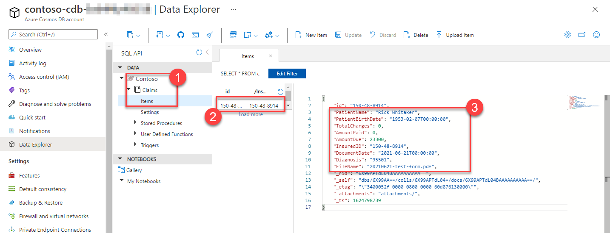

15. To have some more data in the Cosmos DB Claims collection, go back and upload all the PDF files available in the `C:\MCW\MCW-main\Hands-on lab\lab-files\claims-forms` folder.

    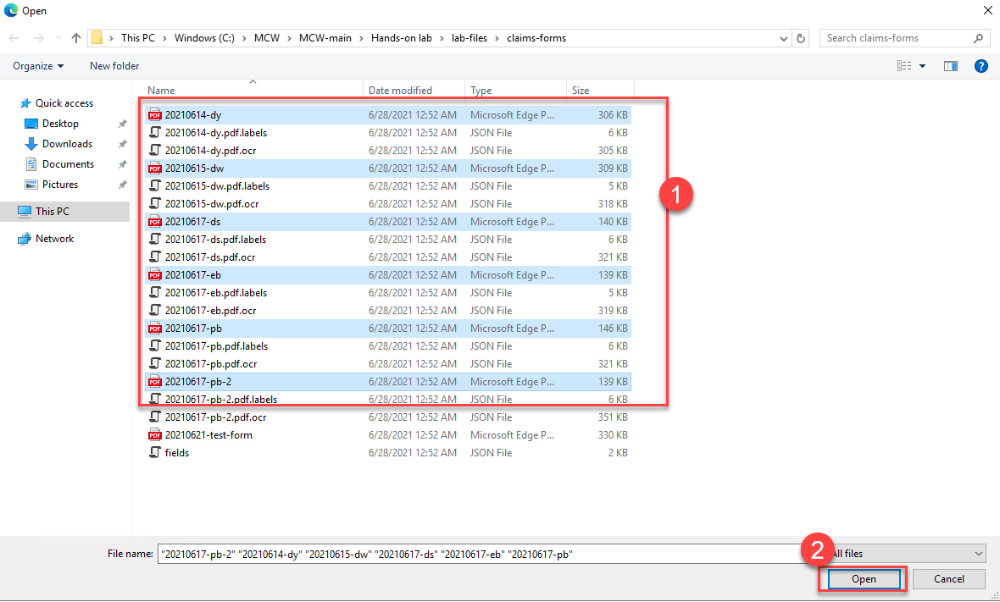

    You can go back to CosmosDB Claims collection and observe the new results.

## Exercise 2: Extract Health Analytics from visit audio records

Duration: 45 minutes

Contoso uploads audio recordings of patient visits to an Azure Storage Blob service. An Azure Function will be triggered with an Event Grid subscription/event handler to process recordings. The function will first detect the language of the recording using [Azure Cognitive Speech Audio Language Identification](https://docs.microsoft.com/en-us/azure/cognitive-services/speech-service/how-to-automatic-language-detection?pivots=programming-language-csharp) and then transcribe it to text. Once transcriptions are ready, Spanish records will be translated to English based on Contoso's requirements. Finally, [Azure Cognitive Services Text Analytics for Health](https://docs.microsoft.com/en-us/azure/cognitive-services/text-analytics/how-tos/text-analytics-for-health?tabs=ner) will extract and label relevant medical information to provide a richer search experience. During the exercise, you will integrate all the pieces, run a couple of sample recordings, and observe the results.

### Task 1: Configuring Azure Functions and Event Grid for audio uploads

As part of its automation process, Contoso will upload audio recordings of patient visits as WAV files to an Azure Storage account as blobs. An Azure Function App has to detect new files and process them with multiple Cognitive Services. For the Functions App to detect new blobs, you will be using a new Azure Event Grid subscription and defining an event handler for the matching Azure Function.

1. In the [Azure portal](https://portal.azure.com), navigate to your **contosoSUFFIX** Storage Account Overview page by selecting **Resource groups** from Azure services list selecting the **hands-on-lab-SUFFIX** resource group, and selecting the **contosoSUFFIX** Storage Account from the list of resources.

   

2. Switch to the **Events (1)** panel. Make sure you are on the **Get Started (2)** page. Select **Azure Function (3)** as the event destination type. Select **Create (4)** to continue.

   

3. From the list of function apps, select the arrow **(1)** for the function app named **contoso-func-SUFFIX** to get a list of functions available. From the list, select the **AudioProcessing** function.

   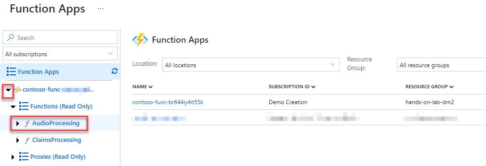

4. Select **Add Event Grid Subscription (1)**.

   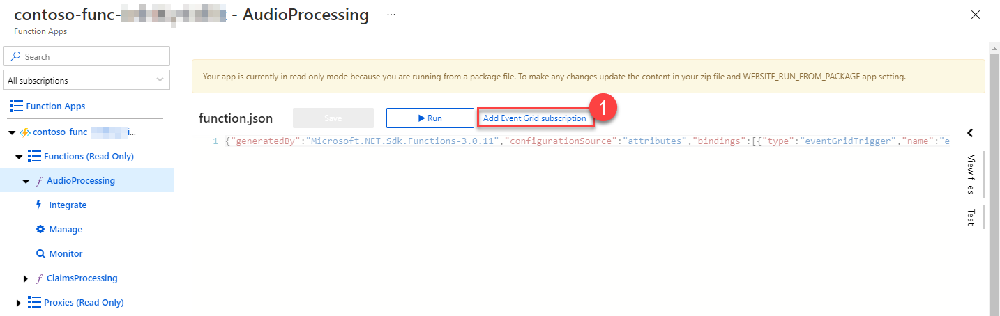

5. Set the values listed below.

    - **Name (1):** **AudioEvents**
    - **Topic Type (2):** Storage account.
    - **Source Resource (3):** Contoso storage account.
    - **System Topic Name (4):** **DocumentEvent**
    - **Filter to Event Types (5):** Blob Created

   

    Select **Create (6)** to continue.

### Task 2: Connecting Cognitive Services to Azure Functions

For audio recording processing, the AudioProcessing function will use multiple Cognitive Service accounts. Cognitive Services Speech will be used to detect the language of the recording and to transcribe the audio file. Cognitive Services Translator will be used to translate Spanish transcriptions to English. Finally, Cognitive Services Text Analytics will be used to extract and label relevant medical information from transcriptions. In this task, you will be connecting all the required Cognitive Services to the AudioProcessing Azure Function.

1. In the [Azure portal](https://portal.azure.com), navigate to your **contoso-speech-SUFFIX** Cognitive Service Overview page by selecting **Resource groups** from Azure services list, selecting the **hands-on-lab-SUFFIX** resource group, and selecting the **contoso-speech-SUFFIX** Cognitive Service Account from the list of resources.

   

2. Switch to the **Keys and Endpoint (1)** panel. Copy **Key 1 (2)** and **Location (3)** to a text editor of your choice to be used in upcoming steps during the lab.

   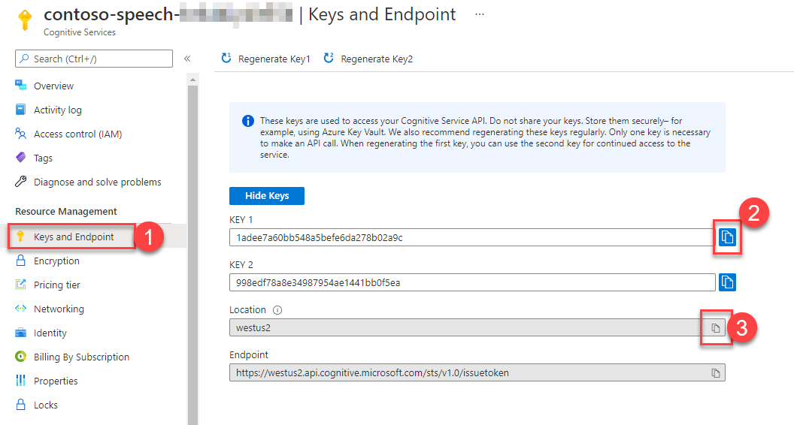

3. Go back to your resource group and find your Cognitive Service named **contoso-translate-SUFFIX** in your lab resource group. Select it to navigate to its Overview page.

   

4. Switch to the **Keys and Endpoint (1)** panel. Copy **Key 1 (2)**, **Location (3)** and **Text Translation Endpoint (4)** to a text editor of your choice to be used in upcoming steps during the lab.

   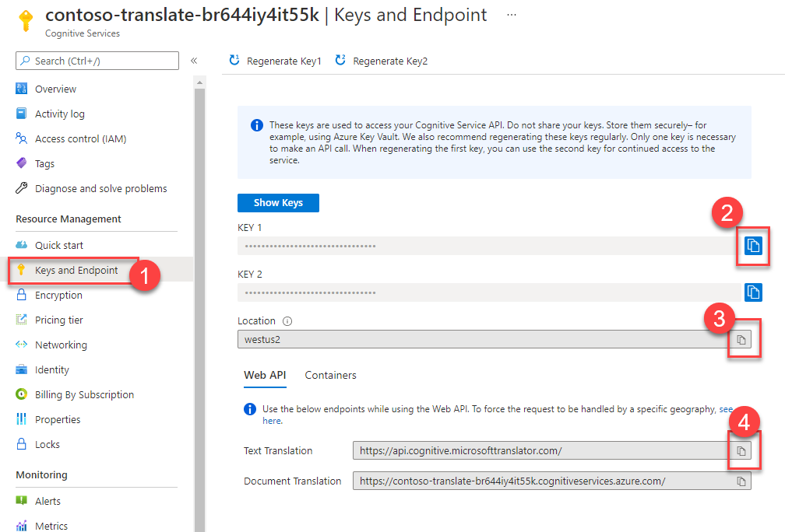

5. Go back to your resource group and find your Cognitive Service named **contoso-textanalytics-SUFFIX** in your lab resource group. Select it to navigate to its Overview page.

   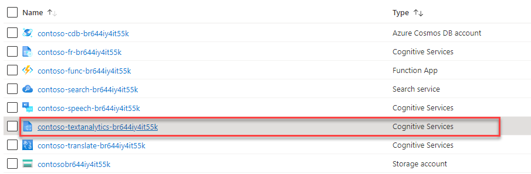

6. Switch to the **Keys and Endpoint (1)** panel. Copy **Key 1 (2)** and **Endpoint (3)** to a text editor of your choice to be used in upcoming steps during the lab.

   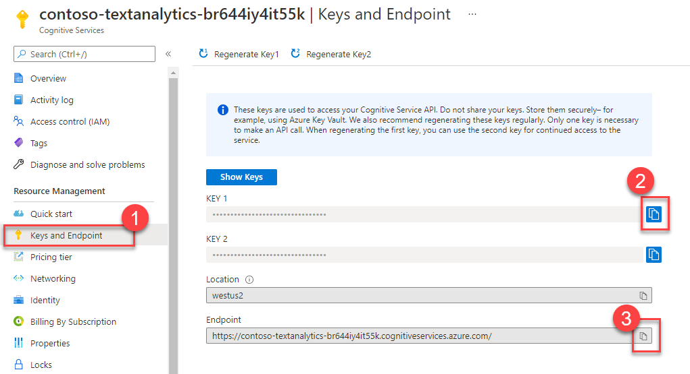

7. Go back to your resource group and find your Function App named **contoso-func-SUFFIX** in your lab resource group. Select it to navigate to its Overview page.

   

8. Switch to the **Configuration (1)** panel. Select **New application setting (2)**.

   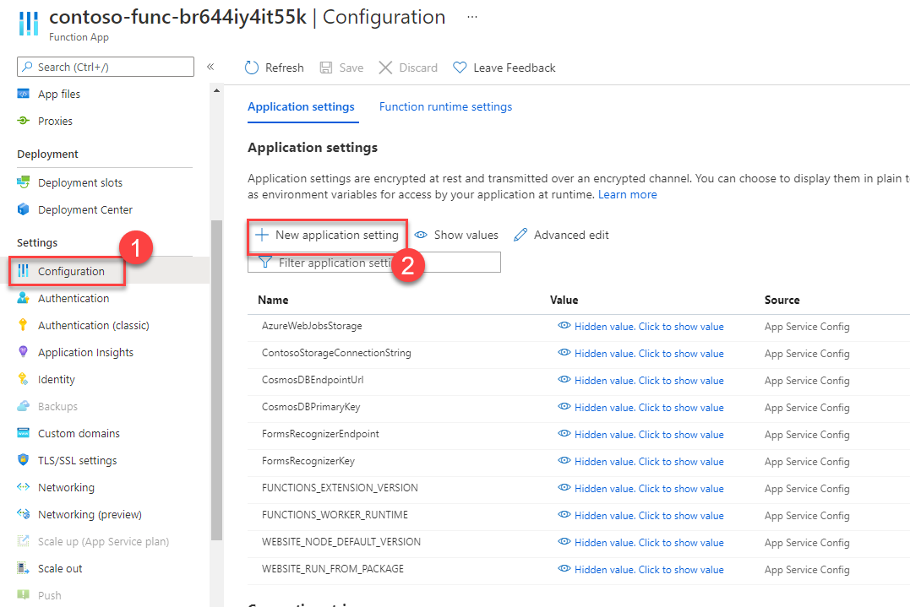

9. Set **Name (1)** to **SpeechRegion** and **Value (2)** to the previously copied Speech service's **Location**. Select **OK (3)** to save.

   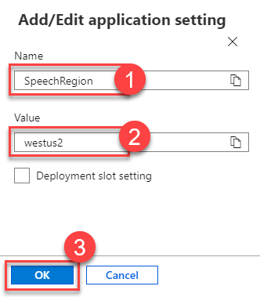

10. Repeat the same steps to add the **Application Settings** listed below.

    | Name                  | Value                                                                                           |
    |-----------------------|-------------------------------------------------------------------------------------------------|
    | SpeechKey             | Previously copied **Key 1** for Cognitive Services Speech Account                               |
    | TranslatorKey         | Previously copied **Key 1** for Cognitive Services Text Translation Account                     |
    | TranslatorEndpoint    | Previously copied **Text Translation Endpoint** for Cognitive Services Text Translation Account |
    | TranslatorLocation    | Previously copied **Location** for Cognitive Services Text Translation Account                  |
    | TextAnalyticsKey      | Previously copied **Key 1** for Cognitive Services Text Analytics Account                       |
    | TextAnalyticsEndpoint | Previously copied **Endpoint** for Cognitive Services Text Analytics Account                    |

11. Once all settings **(1)** are set, select **Save (2)**.

    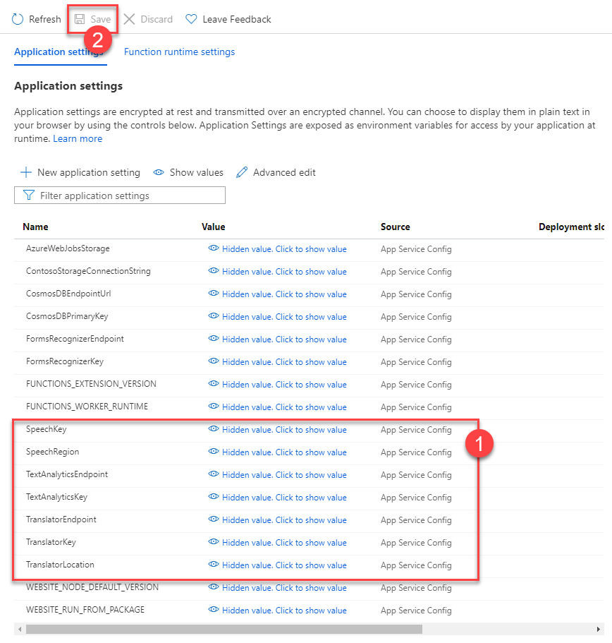

### Task 3: Running audio record processing automation

Now that all implementations are completed, we can upload new patient recordings and see the entire process of transcription, translation, and the extraction of medical information from audio files.

1. Connect to your LABVM. Open **Edge** and navigate to the [Azure portal](https://portal.azure.com). Enter your credentials to access your subscriptions. Navigate to **contosoSUFFIX** storage account by selecting **Resource groups** from Azure services list, selecting the **hands-on-lab-SUFFIX** resource group, and selecting the **contosoSUFFIX** Storage Account from the list of resources.

    

2. Switch to the **Containers (1)** panel. Select the **audiorecordings (2)** container.

   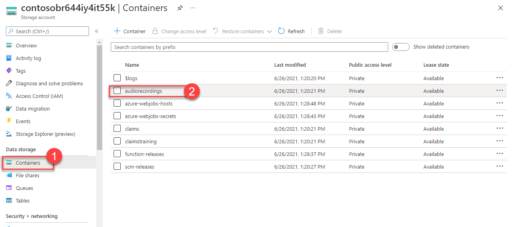

3. Select **Upload (1)** and **Browse (2)**. Navigate to `C:\MCW\MCW-main\Hands-on lab\lab-files\audio-recordings` **(3)**. Choose all the files **(4)** and select **Open (5)**.

    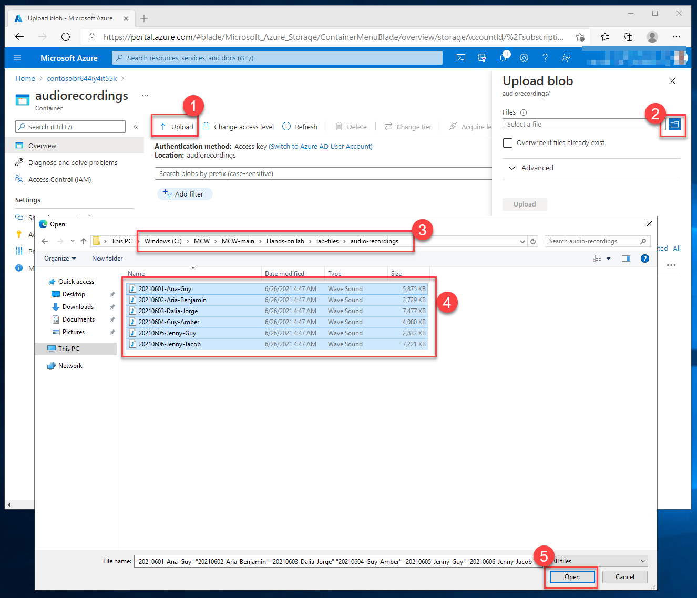

4. Select **Upload** to start the upload process.

5. Now, if everything went smoothly, we should see the result in the Cosmos DB service. Go back to your resource group and find your Cosmos DB Account named `contoso-cdb-SUFFIX` in your lab resource group. Select it to navigate to its Overview page.

    

6. Select **Data Explorer**.

    

7. Select the **Items (1)** list under the **Contoso** database's **Transcriptions** collection. Select the first document **(2)** to see it's content. Take a look at the **TranscribedText (3)** and **HealthcareEntities (4)** extracted.

    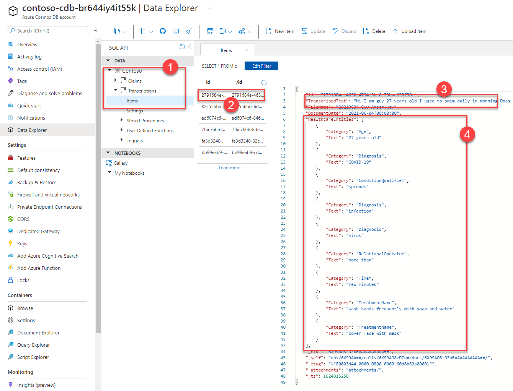

## Exercise 3: Using Azure Cognitive Search to index and serve data

Duration: X minutes

Contoso has an internal web portal hosted in an Azure App Service where staff can access various content and forms. The organization is looking to enhance the portal by centralizing patient information, streamlining, unifying, and simplifying access to claims documents and audio recordings. In this exercise, you will be indexing claims and audio transcriptions data sets in a Cognitive Search service using indexers that connect to Cosmos DB. [Azure Cognitive Search](https://docs.microsoft.com/en-us/azure/search/search-what-is-azure-search) is a cloud search service that gives developers an architecture, APIs, and tools to build rich search experiences over private, heterogenous content in web, mobile, and enterprise applications. Finally, you will configure the web portal to use the indexes for a unified search experience enriched with health analytics metadata.

### Task 1: Setting up indexer for forms documents

1. In the [Azure portal](https://portal.azure.com), navigate to your **contoso-search-SUFFIX** Search service's Overview page by selecting **Resource groups** from Azure services list selecting the **hands-on-lab-SUFFIX** resource group, and selecting the **contoso-search-SUFFIX** Search service from the list of resources.

   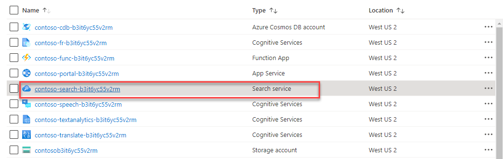

2. Once you are on the **Overview (1)** page select **Import data (2)** to continue.

   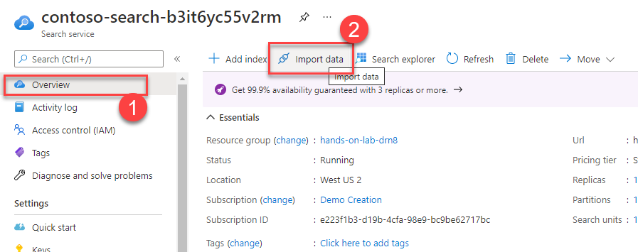

3. On the **Connect to your data** step set **Data Source (1)** to **Azure Cosmos DB** and **Data source name (2)** to **ClaimsSource**. Select **Choose an existing connection (3)** to continue.

   

4. Select **contoso-cdb-SUFFIX** Cosmos DB account as the source.

   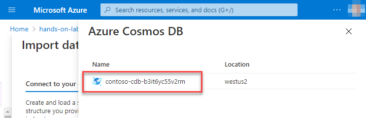

5. Set **Database (1)** to **Contoso** and **Collection (2)** to **Claims**. Select **Next: Add cognitive skills (Optional)** to Continue.

   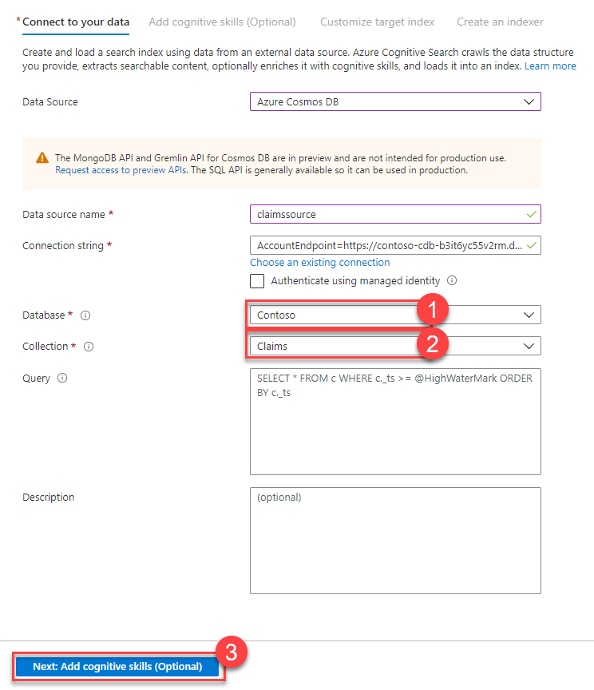

6. On the **Add cognitive skills (Optional)** page select **Skip to: Customize target Index**.

7. On the **Customize target index** page set **Index name (1)** to **claims-index**. Make sure Retrievable, Filterable, Sortable, Facetable and Searchable checkboxes **(2)** for all fields match the setup in the following screen shot. Select **Next: Create an indexer** to continue.

   

8. On the **Create an indexer** page set **Name (1)** to **claims-indexer** adn select **Submit (2)** to continue. We will leave the indexer schedule set to **Once** as we are not expecting data changes in Cosmos DB in our lab environment. However, you should set a different schedule to index new documents saved in Cosmos DB.

   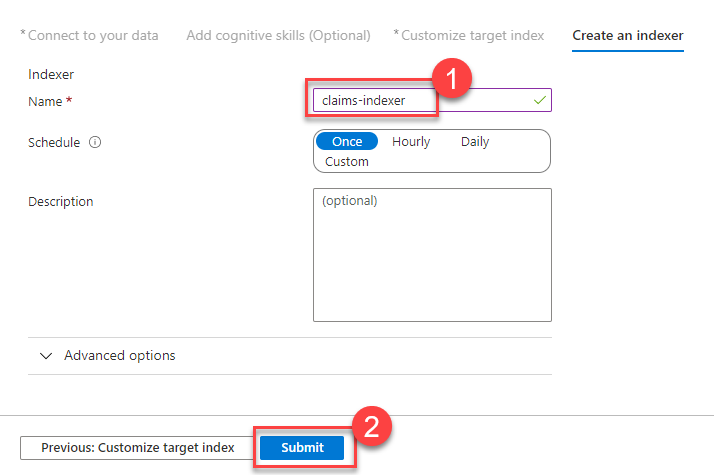

9. Once you are back on the **Overview (1)** page switch to the **Indexers (2)** list to see the status **(3)** of the indexer and the amount of documents indexed **(4)**. Select **Search explorer (5)** to continue.

   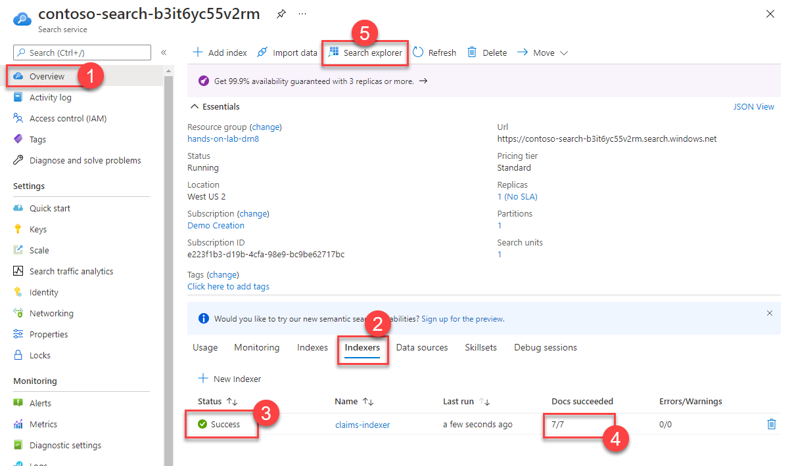

10. Select **Search (1)** to see a list of documents **(2)** from the index.

    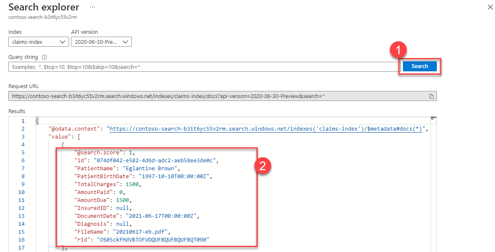

### Task 2: Setting up indexer for audio transcriptions and health analytics

### Task 3: Connecting Azure Cognitive Search to hospital portal

## Exercise 4: Building custom PowerBI reports on healthcare data

Duration: X minutes

\[insert your custom Hands-on lab content here . . . \]

### Task 1: Connecting PowerBI to CosmosDB

### Task 2: Creating PowerBI report unifying structured and unstructured data

## After the hands-on lab

Duration: X minutes

\[insert your custom Hands-on lab content here . . .\]

### Task 1: Task name

1. Number and insert your custom workshop content here . . .

    - Insert content here

        -  

### Task 2: Task name

1. Number and insert your custom workshop content here . . .

    - Insert content here

        -

You should follow all steps provided *after* attending the Hands-on lab.
