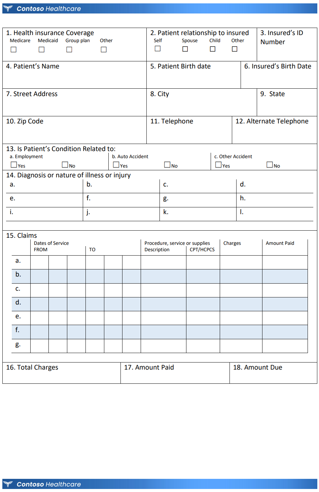

# AI-led business process automation

Contoso Healthcare is a major hospital network consisting of multiple locations across the United States. One of Contoso Healthcare's most significant needs is to have the ability to process handwritten and electronically filled medical claims forms. Currently, each hospital uploads image representations of completed forms via an Azure File Share. Employees then review each document and enter data manually into the claims system. Contoso Healthcare is looking to automate the business process of extracting claims form data and provide valuable reporting visualizations from the claims data ingested. 

In addition to claims processing, Contoso Healthcare needs to transcribe, translate, and store patient/doctor visit audio recordings. A key benefit to obtaining audio transcripts is the ability to surface valuable medical terms, dosage instructions, and diagnoses discussed. Therefore, the information transcribed needs to be analyzed and enhanced with medical labeling and provided as a source for search functionality in their web portal.

June 2021

## Target audience

- Application developer
- AI developer
- Data engineer

## Abstracts

### Workshop

In this workshop, you will learn to automate a business process end-to-end using a variety of Azure Cognitive Services.

At the end of this workshop, you will be better able to architect and implement a business process automation solution that leverages Azure Cognitive Services.

### Whiteboard design session

In this whiteboard design session, you will work in a group to automate the business process of extracting data from form documents and perform visit audio transcription (and translation where required). You will evaluate Azure tools and services to design an optimal architecture that will fulfill Contoso Healthcare's business process automation requirements.

At the end of this whiteboard design session, you will be better able to architect a solution to automate and enrich an existing business process and provide further insight into data using Azure Cognitive Services.

### Hands-on lab

In this hands-on lab, you will learn to train a Form Recognizer model to extract data from images of documents and use Speech services to transcribe and translate audio. You will also learn to analyze transcribed text with Healthcare text analytics to extract medical terminology, medication dosages, and diagnoses.

At the end of this hands-on lab, you will be better able to implement a business process automation solution that leverages Azure Cognitive Services.

#### Draft exercise outline
- Before the HOL
  - Task 1: Create resource group
  - Task 2: Create Cognitive Services resource
- Exercise 1: Claims form processing
  - Task 1: Train Forms Recognizer with sample claims forms
  - Task 2: Configure Azure Function to perform document processing
  - Task 3: Setup Event Grid for data flow (triggers function)
  - Task 4: Executing the claims form data pipeline (view JSON results)
  - Task 5: Visualizing claim processing results in Power BI (over storage)
- Exercise 2: Processing visit audio
  - Task 1: Configure Azure Function to perform audio transcription (identify language, speech-to-text)
  - Task 2: Configure Azure Function to perform text translation (translate to English if necessary)
  - Task 3: Setup Event Grid for data flow (triggers function)
  - Task 4: Executing the audio processing data pipeline (view results)
- Exercise 3: Cognitive Search on audio
  - Task 1: Create the search index on audio transcription (translated)
  - Task 2: Enhance audio transcription using healthcare text analytics
  - Task 3: Configure the web portal to use the search index
- After the hands-on lab
  - Task 1: Delete resource group

## Azure services and related products

- App Service
- Cognitive Services: Form Recognizer
- Cognitive Services: Healthcare Text Analytics
- Cognitive Services: Speech-to-Text
- Cognitive Services: Speech Translation
- Cognitive Search
- Function App
- Azure Data Lake Storage Gen2
- Power BI
- Visual Studio Code

## Related references

Hospitals in the Contoso Healthcare network provide images of claim forms and visit audio recordings via an Azure File Share. The event grid propagates the blob creation event that triggers a Function App to perform document/audio processing. If required, the audio processing will also translate from the source language to English. Healthcare Text analytics is also applied to the transcribed text to surface medical terminology, dosage requirements, and diagnoses. The results of both claims form processing and visit audio processing is stored in Cosmos DB. The data obtained from claims processing is surfaced through a Power BI report, and the data from the visit audio recordings is surfaced through Cognitive search.

### Claims form

[Claims Form PDF](Media/HealthClaimForm.pdf)

[Claims Form DOCX](Media/HealthClaimForm.docx)

## Help & Support

We welcome feedback and comments from Microsoft SMEs & learning partners who deliver MCWs.  

***Having trouble?***

- First, verify you have followed all written lab instructions (including the Before the Hands-on lab document).
- Next, submit an issue with a detailed description of the problem.
- Do not submit pull requests. Our content authors will make all changes and submit pull requests for approval.  

If you are planning to present a workshop, *review and test the materials early*! We recommend at least two weeks prior.

### Please allow 5 - 10 business days for review and resolution of issues
