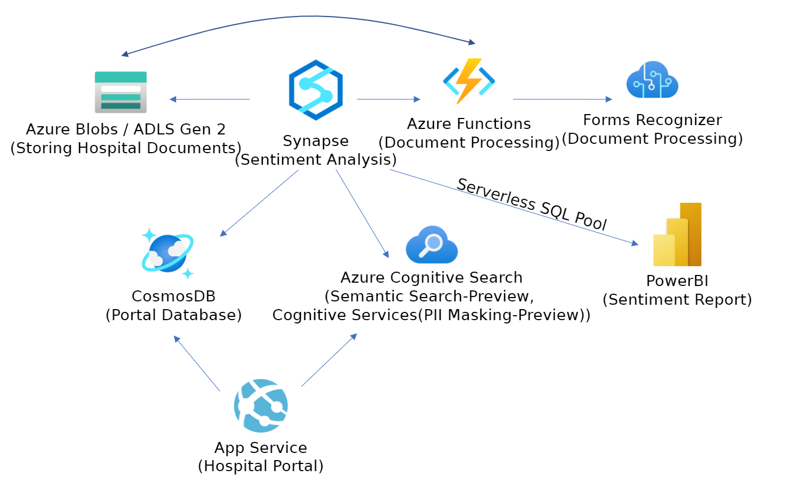

# AI-led business process automation

Contoso Healthcare is a major hospital network consisting of multiple locations across the United States. Many critical business processes revolve around data acquisition via paper forms such as patient intake, patient satisfaction surveys, and employee safety reports. Image representations of completed forms get uploaded on a nightly basis through an Azure File Share. Upstream systems provide images of these forms to an Azure storage account on a nightly basis. Currently, the data from these form images are processed manually and entered into the system by employees. Contoso Healthcare is looking to automate the business process of ingesting and processing form data while adding an enhanced search functionality that leverages AI into their existing hospital portal. The content of some of the form fields is free-text; therefore, they also have concerns regarding divulging PII in search results to less privileged users. They also need a high-level dashboard to keep them informed of the ratio of patients presenting with a positive versus negative outlook to their healthcare services.

June 2021

## Target audience

- Application developer
- AI developer
- Data engineer
- Data architect

## Abstracts

### Workshop

In this workshop, you will learn to automate a business process end-to-end using a variety of Azure Cognitive Services integrated with Azure Cognitive Search and Azure Synapse. First, you will train a Form Recognizer model to extract data from form documents. You will build an Azure Synapse Analytics pipeline to exercise this model to extract data for a Cognitive Search index. The index enriches this data by applying a skill to mask PII in a new field. You will then add a Semantic Search layer that further augments this index to provide more insightful and contextual search results through AI, specifically through natural language understanding. You will integrate this search functionality into the hospital portal web application. In addition to search, you will learn how to leverage the integration of Cognitive Services with Azure Synapse Analytics by enriching processed data with sentiment analysis to be visualized through a Power BI report.

At the end of this workshop, you will be better able to architect and implement a business process automation solution that leverages Azure Cognitive Services.

### Whiteboard design session

In this whiteboard design session, you will work in a group to automate the business process of extracting data from form documents. You will leverage AI to process and enrich this data to meet the goals of Contoso Healthcare. You will also evaluate Azure tools and services to design an optimal architecture that will fulfill their needs. You will incorporate Natural Language Processing to offer an AI-enabled search experience with semantic ranking and AI summarization. Because PII may be present in the data collected, you will need to ensure raw data is secure from unauthorized access. You will guide Contoso Healthcare to include powerful search capabilities into their design, paying particular attention to not divulging PII data. You will also need to include provisions to support a high-level sentiment analysis report based on patient satisfaction surveys. You will build an architecture from start to finish that will consist of AI-based data ingestion, AI incorporated data enrichment, AI-enabled contextual search, and rich visual reporting through Power BI.

At the end of this whiteboard design session, you will be better able to architect a solution to automate and enrich an existing business process and provide further insight into data using Azure Cognitive Services.

### Hands-on lab

In hands-on lab, you will learn to train a Form Recognizer model to extract data from forms. You will build an Azure Synapse Analytics pipeline to automate that leverages this model via a Function App activity to extract data from images of forms. This data is then indexed with the help of Azure Cognitive Search and served with Semantic Search to incorporate semantic relevance and language understanding to search results. The data extracted will be enriched with a skill to mask PII data from less privileged users. The search index is then integrated as a feature in the hospital portal.

You will take advantage of the Azure Synapse Analytics integration with Cognitive Services to generate a Synapse Notebook that further enriches extracted patient responses on patient satisfaction surveys with sentiment analysis and stores the result in a Spark table. This table is exposed to a Power BI sentiment report via a serverless SQL Pool. This notebook is then integrated into the existing Synapse pipeline.

At the end of this hands-on lab, you will be better able to implement a business process automation solution that leverages Azure Cognitive Services.

## Azure services and related products

- App Service
- Cognitive Services: Form Recognizer
- Cognitive Services: Text Analytics - Sentiment Analysis
- Cognitive Search and Semantic Search
- Function App
- Azure Data Lake Storage Gen2
- Azure Synapse Analytics
- Apache Spark in Azure Synapse Analytics
- Power BI
- Visual Studio Code

## Related references

On a nightly basis, from image files are added to an Azure Files Share. An Azure Synapse Analytics pipeline initiates an Azure Functions activity that leverages a trained Form Recognizer model to extract data from the images. The result of the data extraction is stored in an ADLS Gen 2 container in JSON format. An Azure Cognitive Search indexer indexes the extracted data in storage and enriches it by applying the PII skill to mask unwanted patient identifiers. After enabling Semantic Search for the index, the search is integrated into the hospital portal web application.

You will take advantage of the Azure Synapse Analytics integration with Cognitive Services to generate a Synapse Notebook that further enriches extracted patient responses with sentiment analysis on the patient satisfaction survey responses and stores the result in a Spark table. This table is exposed to a Power BI sentiment report via a serverless SQL Pool. This notebook is then integrated into the existing Synapse pipeline.

example HOL exercise outline (links are not live):

1. Exercise 1: Extract Text and Structure from Documents with Forms Recognizer
   1. Task 1: Prepare Custom Model to process documents
   2. Task 2: Configure Azure Functions for document processing
   3. Task 3: Setting up a Synapse Pipeline for data flow management
2. Exercise 2: Implementing Semantic Search for the web site
   1. Task 1: Moving data to Azure Cognitive Search with Synapse
   2. Task 2: Enabling Semantic Search for the Search Index
   3. Task 3: Configure the web portal to use semantic ranking and AI summarization
3. Exercise 3: Data Enrichment with PII Masking Cognitive Skill
   1. Task 1: Configure PII Masking Skill and Indexer
   2. Task 2: Running the Indexer
   3. Task 3: Configure the web portal to use enrichment data
4. Exercise 4: Building Customer Sentiment Reporting
   1. Task 1: Moving data to a Synapse Spark Table
   2. Task 2: Implementing Sentiment Analysis in Synapse
   3. Task 3: Creating Sentiment Report
5. After the hands-on lab
   1. Task 1: Delete resource group

## Help & Support

We welcome feedback and comments from Microsoft SMEs & learning partners who deliver MCWs.  

***Having trouble?***

- First, verify you have followed all written lab instructions (including the Before the Hands-on lab document).
- Next, submit an issue with a detailed description of the problem.
- Do not submit pull requests. Our content authors will make all changes and submit pull requests for approval.  

If you are planning to present a workshop, *review and test the materials early*! We recommend at least two weeks prior.

### Please allow 5 - 10 business days for review and resolution of issues
