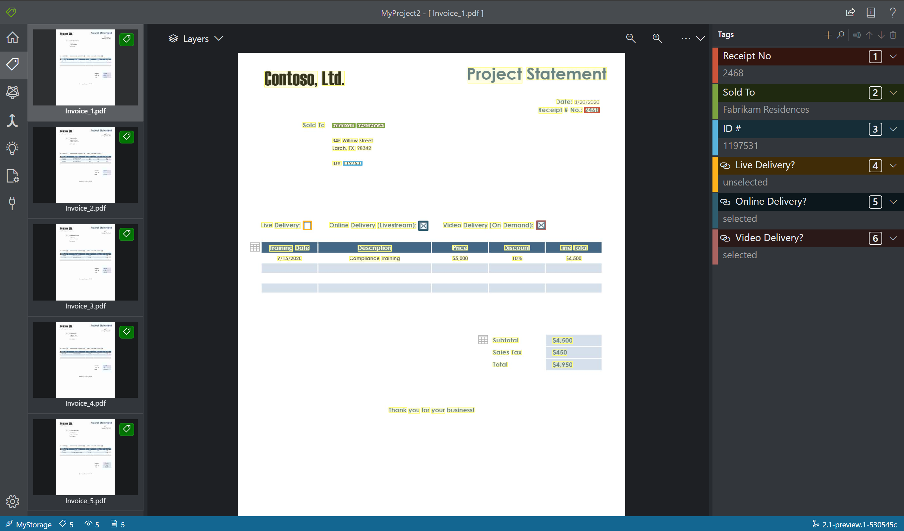
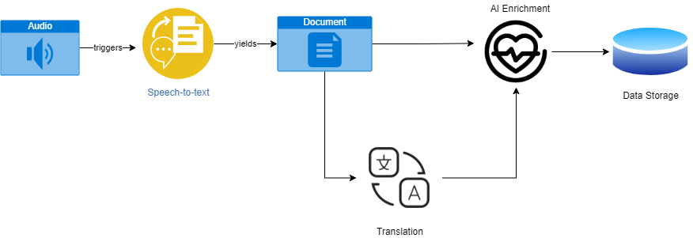

AI-led business process automation

Whiteboard design session trainer guide

June 2021

Information in this document, including URL and other Internet Web site references, is subject to change without notice. Unless otherwise noted, the example companies, organizations, products, domain names, e-mail addresses, logos, people, places, and events depicted herein are fictitious, and no association with any real company, organization, product, domain name, e-mail address, logo, person, place or event is intended or should be inferred. Complying with all applicable copyright laws is the responsibility of the user. Without limiting the rights under copyright, no part of this document may be reproduced, stored in or introduced into a retrieval system, or transmitted in any form or by any means (electronic, mechanical, photocopying, recording, or otherwise), or for any purpose, without the express written permission of Microsoft Corporation.

Microsoft may have patents, patent applications, trademarks, copyrights, or other intellectual property rights covering subject matter in this document. Except as expressly provided in any written license agreement from Microsoft, the furnishing of this document does not give you any license to these patents, trademarks, copyrights, or other intellectual property.

The names of manufacturers, products, or URLs are provided for informational purposes only and Microsoft makes no representations and warranties, either expressed, implied, or statutory, regarding these manufacturers or the use of the products with any Microsoft technologies. The inclusion of a manufacturer or product does not imply endorsement of Microsoft of the manufacturer or product. Links may be provided to third party sites. Such sites are not under the control of Microsoft and Microsoft is not responsible for the contents of any linked site or any link contained in a linked site, or any changes or updates to such sites. Microsoft is not responsible for webcasting or any other form of transmission received from any linked site. Microsoft is providing these links to you only as a convenience, and the inclusion of any link does not imply endorsement of Microsoft of the site or the products contained therein.

© 2021 Microsoft Corporation. All rights reserved.

Microsoft and the trademarks listed at <https://www.microsoft.com/en-us/legal/intellectualproperty/Trademarks/Usage/General.aspx> are trademarks of the Microsoft group of companies. All other trademarks are property of their respective owners.

**Contents**

<!-- TOC -->

- [Trainer information](#trainer-information)
  - [Role of the trainer](#role-of-the-trainer)
  - [Whiteboard design session flow](#whiteboard-design-session-flow)
  - [Before the whiteboard design session: How to prepare](#before-the-whiteboard-design-session-how-to-prepare)
  - [During the whiteboard design session: Tips for an effective whiteboard design session](#during-the-whiteboard-design-session-tips-for-an-effective-whiteboard-design-session)
- [AI-led business process automation whiteboard design session student guide](#ai-led-business-process-automation-whiteboard-design-session-student-guide)
  - [Abstract and learning objectives](#abstract-and-learning-objectives)
  - [Step 1: Review the customer case study](#step-1-review-the-customer-case-study)
    - [Customer situation](#customer-situation)
    - [Customer needs](#customer-needs)
    - [Customer objections](#customer-objections)
    - [Infographic for common scenarios](#infographic-for-common-scenarios)
  - [Step 2: Design a proof of concept solution](#step-2-design-a-proof-of-concept-solution)
  - [Step 3: Present the solution](#step-3-present-the-solution)
  - [Wrap-up](#wrap-up)
  - [Additional references](#additional-references)
- [AI-led business process automation whiteboard design session trainer guide](#ai-led-business-process-automation-whiteboard-design-session-trainer-guide)
  - [Step 1: Review the customer case study](#step-1-review-the-customer-case-study-1)
  - [Step 2: Design a proof of concept solution](#step-2-design-a-proof-of-concept-solution-1)
  - [Step 3: Present the solution](#step-3-present-the-solution-1)
  - [Wrap-up](#wrap-up-1)
  - [Preferred target audience](#preferred-target-audience)
  - [Preferred solution](#preferred-solution)
  - [Checklist of preferred objection handling](#checklist-of-preferred-objection-handling)
  - [Customer quote (to be read back to the attendees at the end)](#customer-quote-to-be-read-back-to-the-attendees-at-the-end)

<!-- /TOC -->

# Trainer information

Thank you for taking time to support the whiteboard design sessions as a trainer!

## Role of the trainer

An amazing trainer:

- Creates a safe environment in which learning can take place.

- Stimulates the participant's thinking.

- Involves the participant in the learning process.

- Manages the learning process (on time, on topic, and adjusting to benefit participants).

- Ensures individual participant accountability.

- Ties it all together for the participant.

- Provides insight and experience to the learning process.

- Effectively leads the whiteboard design session discussion.

- Monitors quality and appropriateness of participant deliverables.

- Effectively leads the feedback process.

## Whiteboard design session flow

Each whiteboard design session uses the following flow:

**Step 1: Review the customer case study (15 minutes)**

**Outcome**

Analyze your customer's needs.

- Customer's background, situation, needs and technical requirements

- Current customer infrastructure and architecture

- Potential issues, objectives and blockers

**Step 2: Design a proof of concept solution (60 minutes)**

**Outcome**

Design a solution and prepare to present the solution to the target customer audience in a 15-minute chalk-talk format.

- Determine your target customer audience.

- Determine customer's business needs to address your solution.

- Design and diagram your solution.

- Prepare to present your solution.

**Step 3: Present the solution (30 minutes)**

**Outcome**

Present solution to your customer:

- Present solution

- Respond to customer objections

- Receive feedback

**Wrap-up (15 minutes)**

- Review preferred solution

## Before the whiteboard design session: How to prepare

Before conducting your first whiteboard design session:

- Read the Student guide (including the case study) and Trainer guide.

- Become familiar with all key points and activities.

- Plan the point you want to stress, which questions you want to drive, transitions, and be ready to answer questions.

- Prior to the whiteboard design session, discuss the case study to pick up more ideas.

- Make notes for later.

## During the whiteboard design session: Tips for an effective whiteboard design session

**Refer to the Trainer guide** to stay on track and observe the timings.

**Do not expect to memorize every detail** of the whiteboard design session.

When participants are doing activities, you can **look ahead to refresh your memory**.

- **Adjust activity and whiteboard design session pace** as needed to allow time for presenting, feedback, and sharing.

- **Add examples, points, and stories** from your own experience. Think about stories you can share that help you make your points clearly and effectively.

- **Consider creating a "parking lot"** to record issues or questions raised that are outside the scope of the whiteboard design session or can be answered later. Decide how you will address these issues, so you can acknowledge them without being derailed by them.

***Have fun**! Encourage participants to have fun and share!*

**Involve your participants.** Talk and share your knowledge but always involve your participants, even while you are the one speaking.

**Ask questions** and get them to share to fully involve your group in the learning process.

**Ask first**, whenever possible. Before launching into a topic, learn your audience's opinions about it and experiences with it. Asking first enables you to assess their level of knowledge and experience, and leaves them more open to what you are presenting.

**Wait for responses**. If you ask a question such as, "What's your experience with (fill in the blank)?" then wait. Do not be afraid of a little silence. If you leap into the silence, your participants will feel you are not serious about involving them and will become passive. Give participants a chance to think, and if no one answers, patiently ask again. You will usually get a response.

# AI-led business process automation whiteboard design session student guide

## Abstract and learning objectives

In this whiteboard design session, you will work in a group to automate the business process of extracting data from form documents and perform visit audio transcription (and translation where required) to extract and label medical information. You will evaluate Azure tools and services to design an optimal architecture to fulfill Contoso Healthcare's business process automation requirements.

At the end of this whiteboard design session, you will be better able to architect a solution to automate and enrich an existing business process and provide further insight into data using Azure Cognitive Services.

## Step 1: Review the customer case study

**Outcome**

Analyze your customer's needs.

Timeframe: 15 minutes

Directions: With all participants in the session, the facilitator/SME presents an overview of the customer case study along with technical tips.

1. Meet your table participants and trainer.

2. Read all of the directions for steps 1-3 in the student guide.

3. As a table team, review the following customer case study.

### Customer situation

Contoso Healthcare is a major hospital network consisting of multiple locations across the United States. One of Contoso Healthcare's most significant needs is to have the ability to process handwritten and electronically filled medical claims forms. Each hospital needs to provide filled forms to Contoso Healthcare's central offices in a standard fashion. Currently, claims forms are completed as both digital files and physical paper documents. Employees then review each document and enter data manually into the claims system. Contoso Healthcare is looking to automate the business process of obtaining claim forms, extracting claims form data to reduce overall form processing time, data-entry errors, and the loss of physical documents. Contoso can also then re-direct their employees to more impactful tasks and increase overall productivity.

In addition to medical claims form processing, Contoso is looking to automate the process of transcribing, translating, and storing patient/doctor visit audio recordings. Currently, each hospital records audio files of patient/physician visits. This data is archived on-premises at each hospital and used strictly as an auditing tool should the details of any visit be questioned. When the results of a patient visit are challenged, the recording of the visit is retrieved and audibly reviewed by hospital employees. Unfortunately, this manual review process is not standard across the hospital network. As a result, each hospital has its own methods of dealing with patient audio file storage, retrieval, and review. A translation may also be needed in addition to patient audio transcription when the visit language is Spanish. Currently, multiple language interpreters need to be on-hand at each hospital for the manual audio review process.

Contoso Healthcare wants to implement useful reporting visualizations over the extracted claims processing data, such as visualizing the ratio of total cost and the amount covered for a patient. Doctors are also interested in extracting critical insights from the patient visit audio transcriptions, preferably via search functionality available on their internal portal site.

### Customer needs

1. Claims forms and patient visit audio files need to be obtained from each hospital in the network consistently.

2. An automated process should extract data from claims forms submitted.

3. A report needs to be created to provide a visualization on total charges versus the amount paid for a specified date range obtained from claims form processing.

4. Audio of the patient visit must be transcribed.

5. If the patient visit audio is in Spanish, transcribed text must be translated into English (en-US).

6. Transcribed patient audio and claims forms must be made searchable from the internal web portal.

7. The process of extracting and storing data from claims forms and obtaining audio transcription from patient visits needs to be automated.

### Customer objections

1. Claims forms are filled out either electronically or are handwritten. We have a concern that handwritten input will not be able to be processed.

2. Patient visit audio may involve conversations in languages other than English. We need a solution that can identify and translate from Spanish into English (en-US). Additional languages might be needed as the network spans to other regions.

3. We want to extract insight from the audio transcriptions of patient visits through our internal portal searches. However, we don't have a data dictionary of medical terms. Is there a solution to analyze our audio transcripts to surface medical terminologies, such as dosages, medications, and diagnoses?

### Infographic for common scenarios

Using the sample labeling tool with Azure Form Recognizer to create a custom model to extract information from a form.

A sample speech-to-text processing flow.

## Step 2: Design a proof of concept solution

**Outcome**

Design a solution and prepare to present the solution to the target customer audience in a 15-minute chalk-talk format.

Timeframe: 60 minutes

**Business needs**

Directions:  With all participants at your table, answer the following questions and list the answers on a flip chart:

1. Who should you present this solution to? Who is your target customer audience? Who are the decision makers?

2. What customer business needs do you need to address with your solution?

**Design**

Directions: With all participants at your table, respond to the following questions on a flip chart:

*File ingestion*

1. Each hospital must submit claims forms in a consistent manner. How do you suggest having each hospital provide claims forms for automated centralized processing?

2. Each hospital must provide patient audio files in a consistent manner. How do you suggest each hospital provide audio files for automated centralized processing? Does this differ from the method you suggested for claims forms? If so, why?

3. Audio and claim form files need to be stored centrally. What type of structure do you recommend to organize these incoming files?

4. The business process of extracting and storing claims form data and audio transcriptions must be automated. What do you recommend to trigger and orchestrate this processing, so that manual intervention is not required?

5. Once a claim form or audio file has been processed, how do you ensure that they do not get processed multiple times?

*Form processing*

1. What Azure service do you recommend to extract data from the claims forms? Are there any tools that can be used to simplify this process?

2. How do you recommend storing the data extracted from the claims forms?

*Reporting*

1. What Azure service do you recommend for the creation of reports to visualize data extracted from both the claims forms and audio transcriptions?

*Audio Transcription and translation*

1. What Azure service do you recommend for transcribing patient visit audio files?

2. How would you identify the spoken language of the visit?

3. What Azure service would you use to translate audio transcriptions to English (en-US)?

4. How do you recommend storing the audio transcription?

5. In case of an audit, how would you be able to track down the original source audio file for a specific transcription?

*Search indexing, enrichment, and implementation*

1. What Azure service do you recommend to index the audio transcription data to make them searchable?

2. How do you recommend keeping the index up-to-date when transcripts are added over time?

3. What Azure service do you recommend to enrich the search index to extract medical insights?

4. What Azure service do you recommend to rank search results based on the search criteria or to identify questions that may be asked and provide direct answers?

5. What steps must be taken to implement the audio transcription search to the internal web portal?

*High-level architecture*

1. Based on your answers to the questions above, diagram a high-level architecture for the initial vision of handling file ingestion, form processing, reporting, audio transcription/translation, as well as search indexing, enhancement, and implementation.

**Prepare**

Directions: With all participants at your table:

1. Identify any customer needs that are not addressed with the proposed solution.

2. Identify the benefits of your solution.

3. Determine how you will respond to the customer's objections.

Prepare a 15-minute chalk-talk style presentation to the customer.

## Step 3: Present the solution

**Outcome**

Present a solution to the target customer audience in a 15-minute chalk-talk format.

Timeframe: 30 minutes

**Presentation**

Directions:

1. Pair with another table.

2. One table is the Microsoft team and the other table is the customer.

3. The Microsoft team presents their proposed solution to the customer.

4. The customer makes one of the objections from the list of objections.

5. The Microsoft team responds to the objection.

6. The customer team gives feedback to the Microsoft team.

7. Tables switch roles and repeat Steps 2-6.

## Wrap-up

Timeframe: 15 minutes

Directions: Tables reconvene with the larger group to hear the facilitator/SME share the preferred solution for the case study.

## Additional references

| Description                               | Links                                                                                                        |
|-------------------------------------------|--------------------------------------------------------------------------------------------------------------|
| Azure Storage Account                     | <https://docs.microsoft.com/en-us/azure/storage/common/storage-account-overview>                             |
| Azure Files                               | <https://docs.microsoft.com/en-us/azure/storage/files/storage-files-introduction>                            |
| Azure Event Grid                          | <https://docs.microsoft.com/en-us/azure/event-grid/overview>                                                 |
| ADLS Gen 2 Best Practices                 | <https://docs.microsoft.com/en-us/azure/storage/blobs/data-lake-storage-best-practices>                      |
| Azure Data Store Models                   | <https://docs.microsoft.com/en-us/azure/architecture/guide/technology-choices/data-store-overview>           |
| Azure Form Recognizer                     | <https://docs.microsoft.com/en-us/azure/cognitive-services/form-recognizer/overview?tabs=v2-1>               |
| Speech Service                            | <https://docs.microsoft.com/en-us/azure/cognitive-services/speech-service/overview>                          |
| Azure Cognitive Search                    | <https://docs.microsoft.com/en-us/azure/search/search-what-is-azure-search>                                  |
| Text Analytics for Health                 | <https://docs.microsoft.com/en-us/azure/cognitive-services/Text-Analytics/how-tos/text-analytics-for-health> |
| Semantic search in Azure Cognitive Search | <https://docs.microsoft.com/en-us/azure/search/semantic-search-overview>                                     |
| Power BI                                  | <https://docs.microsoft.com/en-us/power-bi/fundamentals/power-bi-overview>                                   |
| Azure Functions                           | <https://docs.microsoft.com/en-us/azure/azure-functions/functions-overview>                                  |

# AI-led business process automation whiteboard design session trainer guide

## Step 1: Review the customer case study

- Check in with your table participants to introduce yourself as the trainer.

- Ask, "What questions do you have about the customer case study?"

- Briefly review the steps and timeframes of the whiteboard design session.

- Ready, set, go! Let the table participants begin.

## Step 2: Design a proof of concept solution

- Check in with your tables to ensure that they are transitioning from step to step on time.

- Provide some feedback on their responses to the business needs and design.

  - Try asking questions first that will lead the participants to discover the answers on their own.

- Provide feedback for their responses to the customer's objections.

  - Try asking questions first that will lead the participants to discover the answers on their own.

## Step 3: Present the solution

- Determine which table will be paired with your table before Step 3 begins.

- For the first round, assign one table as the presenting team and the other table as the customer.

- Have the presenting team present their solution to the customer team.

  - Have the customer team provide one objection for the presenting team to respond to.

  - The presentation, objections, and feedback should take no longer than 15 minutes.

  - If needed, the trainer may also provide feedback.

## Wrap-up

- Have the table participants reconvene with the larger session group to hear the facilitator/SME share the following preferred solution.

## Preferred target audience

Senaabil Chandi, the CTO of Contoso Healthcare

The primary audience is the business decision makers and technology decision makers. Usually we talk to the infrastructure managers who report to the chief information officers (CIOs), or to application sponsors (like a vice president [VP] line of business [LOB], or to those who represent the business unit IT or developers that report to application sponsors.

## Preferred solution

*File ingestion*

1. Each hospital must submit claims forms in a consistent manner. How do you suggest having each hospital provide claims forms for automated centralized processing?

    Each hospital should deliver claims forms digitally. This means that any handwritten forms should be scanned and provided as digital files. These files should be uploaded to an Azure Storage Account. In order to simplify the upload process, the Azure Files service can be used to expose the storage account as a network file share. It is essential at this level to remove the handling of paper forms and proceed with a 100% digital process.

2. Each hospital must provide patient audio files in a consistent manner. How do you suggest each hospital provide audio files for automated centralized processing? Does this differ from the method you suggested for claims forms? If so, why?

    It is recommended to keep uploading of files consistent. Each hospital should use the same method to upload audio files as it does the claims forms.

3. Audio and claim form files need to be stored centrally. What type of structure do you recommend to organize these incoming files?

   There are multiple valid approaches to file organization. When using using batch processing, a common approach is to use the following structure (subject matter could be "claimsform" or "visitaudio"):

    1. {Hospital}/{SubjectMatter}/In/{yyyy}/{mm}/{dd}/{hh}/
    2. {Hospital}/{SubjectMatter}/Out/{yyyy}/{mm}/{dd}/{hh}/
    3. {Hospital}/{SubjectMatter}/Bad/{yyyy}/{mm}/{dd}/{hh}/

    Using this structure, files land in the "in" directory, and when processed, the new data is placed in the "out" directory. Should the processing of a file fail, it can be moved into a "bad" folder for further review.

4. The business process of extracting and storing claims form data and audio transcriptions must be automated. What do you recommend to trigger and orchestrate this processing so that manual intervention is not required?

    Similar to file organization, multiple approaches to process triggering also exist. You can use timer triggers in Azure Functions, schedule triggers in Azure Logic Apps, and even scheduled triggers for an Azure Synapse Analytics pipeline. You also can utilize event-based triggers. An example of an event-based trigger is to use Event Grid that can identify the storage account as an event source and watch for the BlobCreated event. This event can initiate the execution of an Azure Function that begins processing the file that was added to storage.

5. Once a claim form or audio file has been processed, how do you ensure that they do not get processed multiple times?

    When using the batch processing in/out/bad approach, the result of the processing is idempotent, meaning that if the files do end up getting processed multiple times, it will result in unchanged values. The results in the "out" folder will remain the same. Data will not be added or removed as long as the "in" folder files are unchanged. When it comes to individual file processing, moving the file to some type of processed or archive location is recommended to ensure that it does not get processed multiple times. If the output data is saved into a database, it is vital to make sure the implementation is idempotent.

*Form processing*

1. What Azure service do you recommend to extract data from the claims forms? Are there any tools that can be used to simplify this process?

    Azure Form Recognizer can be used to train a custom model to extract information from a form. The [sample labeling tool](https://docs.microsoft.com/en-us/azure/cognitive-services/form-recognizer/label-tool?tabs=v2-1) can be used to provide an intuitive user interface to identify the regions of the form from where data should be extracted, resulting in a supervised learning model that can be used to extract data from subsequent forms. Training should take place with a minimum of 5 samples when using supervised (labeled) learning.

2. How do you recommend storing the data extracted from the claims forms?

    The result of the data extraction process using the Form Recognizer yields JSON documents. This data can be further processed and stored in a relational database, the results can be saved to a storage account as files, or they can be stored as documents in a NoSQL type of database, like Cosmos DB.

*Reporting*

1. What Azure service do you recommend for the creation of reports to visualize data extracted from the claims forms?

    Power BI is a collection of software services, apps, and connectors that work together to turn your unrelated data sources into coherent, visually immersive, and interactive insights. The data can be sourced from various cloud-based services, such as Azure Storage and Cosmos DB.

*Audio Transcription and translation*

1. What Azure service do you recommend for transcribing patient visit audio files?

    Azure Speech Service provides APIs to transcribe from audio files, either individually or in batch.

2. How would you identify the spoken language of the visit?

    Language identification is available using the [Speech Service speech-to-text APIs](https://docs.microsoft.com/en-us/azure/cognitive-services/speech-service/language-support). Alternatively, language identification is also available for transcribed text using [Azure Text Analytics APIs](https://docs.microsoft.com/en-us/azure/cognitive-services/text-analytics/how-tos/text-analytics-how-to-language-detection).

3. What Azure service would you use to translate audio transcriptions to English (en-US)?

    The [Azure Speech service](https://docs.microsoft.com/en-us/azure/cognitive-services/speech-service/speech-translation) provides translation in speech-to-text as well as speech-to-speech. The [Microsoft Translator service](https://docs.microsoft.com/en-us/azure/cognitive-services/translator/translator-info-overview) can also be leveraged to accomplish the same goal. Speech translation, powered by Translator, is also available through the Azure Speech service. It combines functionality from the Translator Speech API and the Custom Speech Service into a unified and fully customizable service. In addition to speech translation, The Microsoft Translator service also offers text and document translation.

4. How do you recommend storing the audio transcription?

    The audio transcription can be stored in the same type of data store as the form data extraction (Cosmos DB).

5. In the case of an audit, how would you be able to track down the original source audio file for a specific transcription?

    Adding metadata fields to help with data lineage, such as processing date and path to the originating source file is recommended.

*Search indexing, enrichment, and implementation*

1. What Azure service do you recommend to index the audio transcription data to make them searchable?

    Azure Cognitive Search allows indexing for a wide variety of sources, including fields in Cosmos DB.

2. How do you recommend keeping the index up-to-date when transcripts are added over time?

    Change detection is available for many indexers. In the case of Cosmos DB, the purpose of a data change detection policy is to identify changed data items efficiently. Currently, the only supported policy is the HighWaterMarkChangeDetectionPolicy using the _ts (timestamp) property in the case of indexing by Azure Cosmos DB. This helps with both performance for large datasets as well ensuring the index stays up to date. Re-indexing can be performed on a scheduled basis or initiated via an API call.

3. What Azure service do you recommend to enrich the search index to extract medical insights?

    Text Analytics for health is a feature of the Text Analytics API service that extracts and labels relevant medical information from unstructured texts such as doctor's notes, discharge summaries, clinical documents, and electronic health records. Use this service as part of the [AI enrichment pipeline](https://docs.microsoft.com/en-us/azure/search/cognitive-search-concept-intro) in Azure Cognitive Search.

4. What Azure service do you recommend to rank search results based on the search criteria or to identify questions that may be asked and provide direct answers?

    Semantic search is a collection of features that improve the quality of search results. When enabled on your search service, it extends the query execution pipeline in two ways. First, it adds secondary ranking over an initial result set, promoting the most semantically relevant results to the top of the list. Second, it extracts and returns captions and answers in the response, which you can render on a search page to improve the user's search experience.

5. What steps must be taken to implement the audio transcription search to the internal web portal?

    Many [tutorials](https://docs.microsoft.com/en-us/azure/search/tutorial-csharp-overview) are available in the Cognitive Search documentation to implement search in web applications on multiple platforms.

*High-level architecture*

1. Based on your answers to the questions above, diagram a high-level architecture for the initial vision of handling file ingestion, form processing, reporting, audio transcription/translation, as well as search indexing, enhancement, and implementation.

Hospitals in the Contoso Healthcare network provide images of claim forms and visit audio recordings via an Azure Storage account. The event grid propagates the blob creation event that triggers a Function App to perform document/audio processing. If required, the audio processing will also translate from the source language to English. Healthcare Text analytics is also applied to the transcribed text to surface medical terminology, dosage requirements, and diagnoses. The results of both claims form processing and visit audio processing is stored in Cosmos DB. The data obtained from claims processing and the data from the visit audio recordings surface in a Power BI report and on the Hospital Portal through Cognitive Search service.

## Checklist of preferred objection handling

1. Claims forms are filled out either electronically or are handwritten. We have a concern that handwritten input will not be able to be processed.

    The Form Recognizer service can extract both digital and handwritten content.

2. Patient visit audio may involve conversations in languages other than English. We need a solution that can identify and translate from multiple languages into English (en-US).

    Language identification and translation are features of both the Speech and Text Analytics service.

3. We want to extract insight from the audio transcriptions of patient visits through our internal portal searches. However, we don't have a data dictionary of medical terms. Is there a solution to analyze our audio transcripts to surface medical terminologies, such as dosages, medications, and diagnoses?

    Text Analytics for health is a feature of the Text Analytics API service that extracts and labels relevant medical information from unstructured texts such as doctor's notes, discharge summaries, clinical documents, and electronic health records.

## Customer quote (to be read back to the attendees at the end)

"Throughout this project, we have not only reduced the effort involved in processing our claims forms, but we have also increased accuracy and turnaround time to gain insights on this data. We have developed essential visualizations on our claims data that allow us to view current and historical trends, which assists us in identifying ways to improve our business model. We have also freed up many of our linguistic staff to work directly with our patients versus having them reviewing and translating visit audio files. One of the most exciting outcomes of this project is that we've also attained ground-breaking insights from our patient audio transcripts by adding Text Analytics for health AI into our search capabilities on our web portal."

- Senaabil Chandi, CTO, Contoso Healthcare
